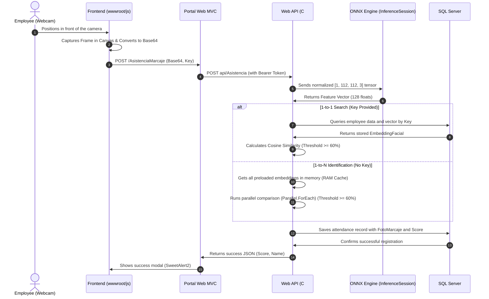

# Facial Recognition in C# with ONNX and ArcFace

Employee attendance tracking through biometrics often relies on cloud services like Azure Cognitive Services or AWS Rekognition. While easy to use, they introduce significant recurring costs and raise privacy concerns by processing faces on third-party servers.

To address this in **RhSoft's** **Asistencia** (Attendance) system, we implemented a **local, self-hosted, high-performance facial recognition engine** in C# and .NET. We combined the speed of **ONNX Runtime** with the accuracy of **ArcFace**, a state-of-the-art deep learning model.

In this article, we explore the theory behind the model, image preprocessing, vector comparison math, and how we structured the service in C# to achieve parallel search times in sub-milliseconds.

---

## 1. The Theory Behind ArcFace and Embeddings

Most traditional classification neural networks end with a *Softmax* layer to predict fixed classes (e.g., identifying if an image belongs to Employee A, B, or C). This does not scale; every time a new employee is hired, the entire network would have to be retrained.

The **ArcFace** model (developed by the [InsightFace](https://github.com/deepinsight/insightface) team) works differently: it acts as a **metric feature extractor**.

1. **Input**: A cropped and aligned face of 112x112 pixels.
2. **Output**: An **embedding** (a one-dimensional vector of 128 float values).
3. **The Geodesic Space**: During training, ArcFace applies a special loss function called *Additive Angular Margin Loss*. This function projects features onto a hypersphere and adds an angular margin to force faces of the same person to be extremely close (minimum intra-class distance) and faces of different people to be far apart (maximum inter-class distance).

Ultimately, this 128-dimensional vector condenses the unique "geometric signature" of a face. Comparing faces is reduced to a purely mathematical problem: measuring how close two vectors are in a 128-dimensional space.

---

## 2. Full System Flow

The system operates on an end-to-end cyclic data flow that avoids local file system dependencies and handles real-time inference:



---

## 3. Input Tensor Preparation (NHWC) in C#

The ArcFace network expects an input tensor (a multidimensional array) with the exact shape `[1, 112, 112, 3]`. This corresponds to the **NHWC** format:
- **N (Batch Size)**: 1 (one face at a time).
- **H (Height)**: 112 pixels high.
- **W (Width)**: 112 pixels wide.
- **C (Channels)**: 3 color channels (Red, Green, Blue).

Pixels read from a camera are represented as color bytes between 0 and 255. However, neural networks require small, normalized numerical values to avoid saturating activation functions. The standard normalization formula for ArcFace is:

```text
Normalized Value = (Original Value - 127.5) / 127.5
```

This shifts and scales color values from [0, 255] to the range of [-1.0, 1.0].

For digital image processing in C#, we use the open-source `SixLabors.ImageSharp` library (version `2.1.9` to avoid the commercial licensing restrictions present in versions `3+`).

Here is how the Base64 image is decoded, resized to 112x112, and loaded into the `DenseTensor<float>` in the [GenerarEmbedding](file:///home/jonas/Lab/RhSoft/RhSoft.API/RhSoftAPI/Services/Asistencia/ReconocimientoFacialService.cs#L36-L112) method of the [ReconocimientoFacialService](file:///home/jonas/Lab/RhSoft/RhSoft.API/RhSoftAPI/Services/Asistencia/ReconocimientoFacialService.cs) class:

```csharp
// 1. Decode Base64 to bytes and load the image
byte[] imageBytes = Convert.FromBase64String(fotoBase64);
using var ms = new MemoryStream(imageBytes);
using var image = Image.Load<Rgb24>(ms);

// 2. Resize in-memory to the exact ArcFace resolution (112x112)
image.Mutate(x => x.Resize(112, 112));

// 3. Create the tensor in HWC format [1, 112, 112, 3]
var tensor = new DenseTensor<float>(new[] { 1, 112, 112, 3 });

// 4. Map pixels and apply mathematical normalization
image.ProcessPixelRows(accessor =>
{
    for (int y = 0; y < accessor.Height; y++)
    {
        var row = accessor.GetRowSpan(y);
        for (int x = 0; x < accessor.Width; x++)
        {
            var pixel = row[x];
            tensor[0, y, x, 0] = (pixel.R - 127.5f) / 127.5f; // Red Channel
            tensor[0, y, x, 1] = (pixel.G - 127.5f) / 127.5f; // Green Channel
            tensor[0, y, x, 2] = (pixel.B - 127.5f) / 127.5f; // Blue Channel
        }
    }
});
```

---

## 4. Model Execution with ONNX Runtime and L2 Normalization

The pre-trained model file is stored as `arcface.onnx`. Loading this file (over 100 MB) into memory and initializing the neural network's millions of parameters is highly resource-intensive. Thus, we register the `InferenceSession` as a **Singleton** in [Program.cs](file:///home/jonas/Lab/RhSoft/RhSoft.API/RhSoftAPI/Program.cs) to load it only once when the API starts.

Once the raw vector is extracted from the network, we perform **L2 normalization** (Euclidean normalization) on the vector. This ensures the vector length is exactly 1.0:

```text
v_norm = v / ||v||_2
```

If all reference embeddings in the database and webcam queries are normalized to a length of 1.0, comparing their similarity becomes much simpler: the dot product between the two vectors directly equals their cosine similarity.

The following C# snippet details the inference and normalization steps:

```csharp
// Prepare input for the ONNX session
string inputNodeName = _session.InputMetadata.Keys.First();
var inputs = new List<NamedOnnxValue>
{
    NamedOnnxValue.CreateFromTensor(inputNodeName, tensor)
};

// Inference (run the neural network)
using var results = _session.Run(inputs);
var outputTensor = results.First().AsTensor<float>();

// Retrieve the feature vector and normalize it in L2
float[] embedding = outputTensor.ToArray();
double sumOfSquares = 0;
for (int i = 0; i < embedding.Length; i++)
{
    sumOfSquares += embedding[i] * embedding[i];
}

float magnitude = (float)Math.Sqrt(sumOfSquares);
if (magnitude > 0)
{
    for (int i = 0; i < embedding.Length; i++)
    {
        embedding[i] /= magnitude; // Divide each element by the Euclidean norm
    }
}

return embedding;
```

---

## 5. Measuring Similarity: Cosine Similarity

Traditional spatial Euclidean distance (straight-line distance) is not optimal when dealing with hyper-dimensional spaces (such as our 128-float vector). Instead, it is much more efficient to calculate the angle between the two vectors using **Cosine Similarity**:

```text
Cosine Similarity(A, B) = (A . B) / (||A||_2 * ||B||_2)
```

- A score of **1.0** indicates that the vectors point in the exact same direction (mathematically identical faces).
- A score of **0.0** means the vectors are orthogonal (no correlation).
- A value of **0.60** or higher is the acceptance threshold tuned for production.

We implement this metric in C# as follows:

```csharp
public double CalcularSimilitud(float[] vectorA, float[] vectorB)
{
    if (vectorA == null || vectorB == null) return 0.0;
    if (vectorA.Length != vectorB.Length) return 0.0;

    double dotProduct = 0.0;
    double normA = 0.0;
    double normB = 0.0;

    for (int i = 0; i < vectorA.Length; i++)
    {
        dotProduct += vectorA[i] * vectorB[i];
        normA += vectorA[i] * vectorA[i];
        normB += vectorB[i] * vectorB[i];
    }

    double magnitude = Math.Sqrt(normA) * Math.Sqrt(normB);
    if (magnitude == 0.0) return 0.0;

    return dotProduct / magnitude;
}
```

---

## 6. Production Optimizations: RAM Caching and Parallel Searches

Querying the database and deserializing a JSON string containing 128 floating-point numbers for every employee each time someone attempts to check in introduces unacceptable latency.

To optimize this, we implemented two key strategies:

### A. Thread-Safe RAM Caching
The [ReconocimientoFacialService](file:///home/jonas/Lab/RhSoft/RhSoft.API/RhSoftAPI/Services/Asistencia/ReconocimientoFacialService.cs) class maintains a static in-memory list:
`private static List<(int IdEmpleado, string NombreCompleto, string ClaveEmpleado, float[] Vector)> _vectoresCache`

At startup, we load the serialized vectors from the database into RAM. This cache automatically invalidates and reloads every **5 minutes** via timestamp checks, or immediately if a new employee photo is registered in the system.

### B. Parallel Comparisons (1:N)
When an employee does not enter their employee ID and the system must identify who they are by comparing their face against the entire organization (1-to-N search), we must utilize CPU threads efficiently. Instead of a standard sequential `foreach` loop, we leverage multi-core parallelism using .NET's `Parallel.ForEach`:

```csharp
public (int? IdEmpleado, double Score) IdentificarEmpleado(
    float[] vectorCamara, 
    List<(int IdEmpleado, string NombreCompleto, string ClaveEmpleado, float[] Vector)> vectoresReferencia)
{
    if (vectorCamara == null || vectoresReferencia == null || !vectoresReferencia.Any())
    {
        return (null, 0.0);
    }

    double mejorScore = 0.0;
    int? mejorIdEmpleado = null;
    object lockObject = new object();

    // Parallel multi-core comparison
    Parallel.ForEach(vectoresReferencia, (refVector) =>
    {
        double similitud = CalcularSimilitud(vectorCamara, refVector.Vector);

        lock (lockObject)
        {
            if (similitud > mejorScore)
            {
                mejorScore = similitud;
                mejorIdEmpleado = refVector.IdEmpleado;
            }
        }
    });

    double umbralEstricto = 0.60;
    if (mejorScore >= umbralEstricto)
    {
        return (mejorIdEmpleado, mejorScore);
    }

    return (null, mejorScore);
}
```

---

## 7. Database Structure and Auditing

Data persistence was designed to be independent of local file system directories, ensuring that system deployment—whether in the cloud or on-premise—remains agnostic to physical file paths:

### `Empleados` (Employees) Table
- `Foto` (`VARBINARY(MAX) NULL`): Stores the employee's original reference photo, which acts as a seed to regenerate embeddings if the model is upgraded in the future.
- `EmbeddingFacial` (`NVARCHAR(MAX) NULL`): Stores the JSON text representation of the float vector generated by ArcFace (e.g., `"[0.0435,-0.1287,...]"`). This avoids computation time during cache loading.

### `RegistrosMarcaje` (Attendance Logs) Table
- `FotoMarcaje` (`VARBINARY(MAX) NULL`): Stores the raw webcam image captured at the exact moment of check-in. This acts as a physical visual audit log against fraud.
- `ScoreReconocimiento` (`DECIMAL(18,4) NULL`): Stores the exact similarity score (e.g., `0.8412`) to monitor and audit threshold behavior across different lighting and ambient environments.

---

## Conclusion

Migrating facial recognition from managed cloud services to a local engine based on **ONNX Runtime and ArcFace** in C# reduced system latency and eliminated AI infrastructure costs to $0. In **RhSoft's** real production environment, this system serves **nearly 1000 active users running on a standard CPU server with no dedicated GPU**, demonstrating exceptional efficiency with virtually imperceptible inference and matching times.

By leveraging native .NET parallelism and RAM-based storage of normalized embeddings, the 1-to-N search process between the in-memory reference database and the captured face adds virtually zero overhead to the recognition flow. The entire validation completes in just a few milliseconds while keeping employee biometric data fully secure within the corporate network.
