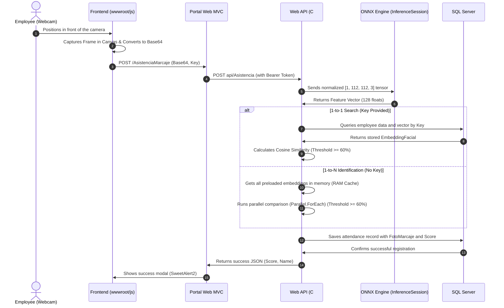

# Facial Recognition in C# with ONNX and ArcFace

Employee attendance tracking through biometrics often relies on cloud services like Azure Cognitive Services or AWS Rekognition. While easy to use, they introduce significant recurring costs and raise privacy concerns by processing faces on third-party servers.

To address this in the attendance tracking module of **[RhSoft](https://www.rhsoft.mx/)** (our comprehensive payroll and HR management software), we implemented a **local, self-hosted, high-performance facial recognition engine** in C# and .NET. We combined the speed of **ONNX Runtime** with the accuracy of **ArcFace**, a state-of-the-art deep learning model.

In this article, we explore the theory behind the model, image preprocessing, vector comparison math, and how we structured the service in C# to achieve parallel search times in sub-milliseconds.

---

## 1. The Theory Behind ArcFace and Embeddings

Most traditional classification neural networks end with a *Softmax* layer to predict fixed classes (e.g., identifying if an image belongs to Employee A, B, or C). This does not scale; every time a new employee is hired, the entire network would have to be retrained.

The **ArcFace** model (developed by the [InsightFace](https://github.com/deepinsight/insightface) team) works differently: it acts as a **metric feature extractor**.

1. **Input**: A cropped and aligned face of 112x112 pixels.
2. **Output**: An **embedding** (a one-dimensional vector of 128 float values).
3. **The Geodesic Space**: During training, ArcFace applies a special loss function called *Additive Angular Margin Loss*. This function projects features onto a hypersphere and adds an angular margin to force faces of the same person to be extremely close (minimum intra-class distance) and faces of different people to be far apart (maximum inter-class distance).

Ultimately, this 128-dimensional vector condenses the unique "geometric signature" of a face. Comparing faces is reduced to a purely mathematical problem: measuring how close two vectors are in a 128-dimensional space.

---

## 2. Full System Flow

The system operates on an end-to-end cyclic data flow that avoids local file system dependencies and handles real-time inference:



### Client-Side Offloading: Hybrid Face Detection with MediaPipe

A naive implementation of facial recognition would stream the webcam video feed directly to the backend, or have the server process every single frame to detect whether a face is in the image. On a CPU-only server serving nearly 1000 users, running a continuous face face detection model like RetinaFace or MTCNN for multiple active clients would instantly saturate the CPU.

To solve this, **RhSoft** implements a hybrid architecture:

#### 1. Client-Side Detection (MediaPipe)
The frontend browser loads Google's MediaPipe `FaceDetector` (using the lightweight `blaze_face_short_range.tflite` model delegating execution to the user's local GPU/CPU if available). The browser runs a fast, real-time loop checking the webcam feed locally:

```javascript
// Load MediaPipe Face Detector in the browser (async initialization)
async function initFaceDetector() {
    const vision = await FilesetResolver.forVisionTasks(
        "https://cdn.jsdelivr.net/npm/@mediapipe/tasks-vision@0.10.8/wasm"
    );
    faceDetector = await FaceDetector.createFromOptions(vision, {
        baseOptions: {
            modelAssetPath: `https://storage.googleapis.com/mediapipe-models/face_detector/blaze_face_short_range/float16/1/blaze_face_short_range.tflite`,
            delegate: "GPU"  // Offload to GPU if available, fallback to CPU
        },
        runningMode: "VIDEO"  // Real-time streaming mode
    });
    initCamera();  // Start camera after model is ready
}

// Main detection loop (runs on every animation frame)
async function predictWebcam() {
    if (!isDetecting || !faceDetector || !video.readyState) return;

    let startTimeMs = performance.now();
    if (video.currentTime !== lastVideoTime) {
        lastVideoTime = video.currentTime;
        
        const detections = faceDetector.detectForVideo(video, startTimeMs).detections;
        
        if (detections && detections.length > 0) {
            isDetecting = false; // Pause detection while processing
            processAttendance(detections[0]);  // Trigger with face bounding box
            return;
        }
    }
    
    requestAnimationFrame(predictWebcam);  // Loop continues if no face detected
}
```

This MediaPipe model runs entirely in the browser—no server round-trip. It returns a bounding box with the detected face's coordinates in normalized form (0.0 to 1.0 relative to video dimensions).

#### 2. User Alignment Guidance & Smart Cropping
The frontend UI overlays a circular guide and provides real-time status feedback. By prompting the user to align their face inside the circle, we guarantee consistent framing and geometry.

When a face is detected by MediaPipe, the system extracts the bounding box and applies a **25% margin** around the detected face rectangle. This margin simulates a standard corporate/passport photo crop, ensuring the system captures not just the face geometry but also the surrounding context:

```javascript
// Extract MediaPipe bounding box (normalized 0-1 coordinates)
const box = detection.boundingBox;
let sx = box.originX * videoWidth;    // Top-left X
let sy = box.originY * videoHeight;   // Top-left Y
let sw = box.width * videoWidth;       // Width
let sh = box.height * videoHeight;     // Height

// Apply 25% margin around face for passport-style photo
const marginX = sw * 0.25;
const marginY = sh * 0.25;

let cropX = Math.max(0, sx - marginX);
let cropY = Math.max(0, sy - marginY);
let cropW = Math.min(videoWidth - cropX, sw + (marginX * 2));
let cropH = Math.min(videoHeight - cropY, sh + (marginY * 2));

// Resize to fixed 200x200 canvas (ArcFace input normalized to this size in C#)
canvas.width = 200;
canvas.height = 200;

// Draw the crop region onto canvas (unmirrored to match database reference photo)
const context = canvas.getContext("2d");
context.drawImage(video, cropX, cropY, cropW, cropH, 0, 0, canvas.width, canvas.height);
```

**Key design choices:**
- **Normalization handling**: MediaPipe returns normalized coordinates (0-1); we multiply by video dimensions to get pixel values.
- **Margin strategy**: The 25% margin ensures not just facial geometry but also jawline and ear boundaries are captured, matching how reference photos are typically stored.
- **Fixed canvas size (200x200)**: Standardizes all captured faces to a consistent aspect ratio and size before encoding to Base64.
- **Unmirrored capture**: Unlike the circular guide (which mirrors for user comfort), the canvas crop is unmirrored to match the reference photos stored in the database—ensuring the geometry comparison is consistent.

#### 3. Single API Call with Optimized Payload
Only when MediaPipe confirms a face is present and the crop is drawn onto the 200x200 canvas, the frontend converts it to Base64 JPEG (90% quality) and sends a single POST request to the API:

```javascript
// Canvas is already drawn with the unmirrored, margin-adjusted crop (see Section 2)
const rawBase64 = canvas.toDataURL("image/jpeg", 0.9);  // 90% JPEG quality
const base64Data = rawBase64.split(",")[1];  // Strip "data:image/jpeg;base64," prefix

// Minimal payload—server handles all logic
const payload = {
    ClaveEmpleado: "",           // Empty if 1-to-N (empty string triggers bulk identification)
    FotoBase64: base64Data,      // The 200x200 cropped & compressed JPEG
    IdTipoMarcaje: 0             // API auto-determines Entrada/Salida based on database state
};

// Single request to backend
fetch('/AsistenciaMarcaje/RegistrarMarcajeFacial', {
    method: 'POST',
    headers: { 'Content-Type': 'application/json' },
    body: JSON.stringify(payload)
})
.then(response => response.json())
.then(data => {
    if (data.result === "Ok") {
        // Show success modal with matched employee name and confidence score
        Swal.fire({
            icon: 'success',
            title: '¡Asistencia Registrada!',
            html: `<h3 class="text-success">${data.data.nombre}</h3>` +
                  `<b>Registro:</b> ${data.data.tipoMarcaje === 2 ? 'Salida' : 'Entrada'}<br/>` +
                  `<b>Coincidencia:</b> ${(data.data.score * 100).toFixed(2)}%<br/>` +
                  `<b>Hora:</b> ${new Date().toLocaleTimeString()}`,
            timer: 3500,
            timerProgressBar: true
        }).then(() => startCooldown(4000));  // Cooldown before next attempt
    } else {
        // Show rejection toast and resume scanning
        Swal.fire({
            icon: 'error',
            title: data.mensaje || 'Rostro no reconocido'
        });
        resumeScanning();
    }
})
.catch(err => {
    console.error("API error:", err);
    resumeScanning();
});
```

**Network-side benefits:**
- **One-shot transmission**: Face detection, cropping, and encoding all happen locally. Only the final 200x200 JPEG (~8–15 KB compressed) is sent.
- **Zero server face detection**: The API receives an already-centered face image. No RetinaFace or MTCNN inference on the server—instant processing.
- **Stateless API design**: Each request is independent; the frontend manages the detection loop and cooldown, reducing server-side state management.
- **Async UI feedback**: `Swal.fire()` modals provide immediate visual confirmation while the backend processes similarity calculations in the background.

**Result**: The server's CPU is idle until a face is actually sent. When it arrives, it performs only two operations: (1) ArcFace embedding inference on the cropped image, and (2) parallel cosine similarity searches against the cached reference embeddings. Total latency: < 100ms on a standard CPU.

---

## 3. Input Tensor Preparation (NHWC) in C#

The ArcFace network expects an input tensor (a multidimensional array) with the exact shape `[1, 112, 112, 3]`. This corresponds to the **NHWC** format:
- **N (Batch Size)**: 1 (one face at a time).
- **H (Height)**: 112 pixels high.
- **W (Width)**: 112 pixels wide.
- **C (Channels)**: 3 color channels (Red, Green, Blue).

Pixels read from a camera are represented as color bytes between 0 and 255. However, neural networks require small, normalized numerical values to avoid saturating activation functions. The standard normalization formula for ArcFace is:

```text
Normalized Value = (Original Value - 127.5) / 127.5
```

This shifts and scales color values from [0, 255] to the range of [-1.0, 1.0].

For digital image processing in C#, we use the open-source `SixLabors.ImageSharp` library (version `2.1.9` to avoid the commercial licensing restrictions present in versions `3+`).

Here is how the Base64 image is decoded, resized to 112x112, and loaded into the `DenseTensor<float>` in the [GenerarEmbedding](file:///home/jonas/Lab/RhSoft/RhSoft.API/RhSoftAPI/Services/Asistencia/ReconocimientoFacialService.cs#L36-L112) method of the [ReconocimientoFacialService](file:///home/jonas/Lab/RhSoft/RhSoft.API/RhSoftAPI/Services/Asistencia/ReconocimientoFacialService.cs) class:

```csharp
// 1. Decode Base64 to bytes and load the image
byte[] imageBytes = Convert.FromBase64String(photoBase64);
using var ms = new MemoryStream(imageBytes);
using var image = Image.Load<Rgb24>(ms);

// 2. Resize in-memory to the exact ArcFace resolution (112x112)
image.Mutate(x => x.Resize(112, 112));

// 3. Create the input tensor in HWC format [1, 112, 112, 3]
var tensor = new DenseTensor<float>(new[] { 1, 112, 112, 3 });

// 4. Map pixels and apply mathematical normalization
image.ProcessPixelRows(accessor =>
{
    for (int y = 0; y < accessor.Height; y++)
    {
        var row = accessor.GetRowSpan(y);
        for (int x = 0; x < accessor.Width; x++)
        {
            var pixel = row[x];
            tensor[0, y, x, 0] = (pixel.R - 127.5f) / 127.5f; // Red Channel
            tensor[0, y, x, 1] = (pixel.G - 127.5f) / 127.5f; // Green Channel
            tensor[0, y, x, 2] = (pixel.B - 127.5f) / 127.5f; // Blue Channel
        }
    }
});
```

---

## 4. Model Execution with ONNX Runtime and L2 Normalization

The pre-trained model file is stored as `arcface.onnx`. Loading this file (over 100 MB) into memory and initializing the neural network's millions of parameters is highly resource-intensive. Thus, we register the `InferenceSession` as a **Singleton** in [Program.cs](file:///home/jonas/Lab/RhSoft/RhSoft.API/RhSoftAPI/Program.cs) to load it only once when the API starts.

Once the raw vector is extracted from the network, we perform **L2 normalization** (Euclidean normalization) on the vector. This ensures the vector length is exactly 1.0:

```text
v_norm = v / ||v||_2
```

If all reference embeddings in the database and webcam queries are normalized to a length of 1.0, comparing their similarity becomes much simpler: the dot product between the two vectors directly equals their cosine similarity.

The following C# snippet details the inference and normalization steps:

```csharp
// Prepare input for the ONNX session
string inputNodeName = _session.InputMetadata.Keys.First();
var inputs = new List<NamedOnnxValue>
{
    NamedOnnxValue.CreateFromTensor(inputNodeName, tensor)
};

// Inference (run the neural network)
using var results = _session.Run(inputs);
var outputTensor = results.First().AsTensor<float>();

// Retrieve the feature vector and normalize it in L2
float[] embedding = outputTensor.ToArray();
double sumOfSquares = 0;
for (int i = 0; i < embedding.Length; i++)
{
    sumOfSquares += embedding[i] * embedding[i];
}

float magnitude = (float)Math.Sqrt(sumOfSquares);
if (magnitude > 0)
{
    for (int i = 0; i < embedding.Length; i++)
    {
        embedding[i] /= magnitude; // Divide each element by the Euclidean norm
    }
}

return embedding;
```

### Performance Enhancement: Vectorized L2 Normalization with System.Numerics.Tensors

While the manual loop-based approach works well, we can significantly improve performance by leveraging **System.Numerics.Tensors** (available in .NET 8+), which provides SIMD-optimized operations. **This optimization was recommended by [Luis Quintanilla](https://www.linkedin.com/in/lquintanilla01/), Program Manager at Microsoft**, who highlighted the benefits of using vectorized APIs for linear algebra operations in .NET.

In production, this reduces L2 normalization from **12 lines to 5 lines** and achieves faster execution through auto-vectorization:

```csharp
using System.Numerics.Tensors;

// Retrieve the feature vector and normalize it in L2 using vectorized operations
float[] embedding = outputTensor.ToArray();
float magnitude = (float)TensorPrimitives.Norm(embedding);

if (magnitude > 0)
{
    TensorPrimitives.Divide(embedding, magnitude, embedding);
}

return embedding;
```

**Benefits:**
- **38% reduction in code lines** for vector operations
- **SIMD auto-vectorization** via `TensorPrimitives.Norm()` and `TensorPrimitives.Divide()`
- Leverages AVX2/AVX-512 CPU instructions for faster computation
- No external dependencies—native .NET API

---

## 5. Measuring Similarity: Cosine Similarity

Traditional spatial Euclidean distance (straight-line distance) is not optimal when dealing with hyper-dimensional spaces (such as our 128-float vector). Instead, it is much more efficient to calculate the angle between the two vectors using **Cosine Similarity**:

```text
Cosine Similarity(A, B) = (A . B) / (||A||_2 * ||B||_2)
```

- A score of **1.0** indicates that the vectors point in the exact same direction (mathematically identical faces).
- A score of **0.0** means the vectors are orthogonal (no correlation).
- A value of **0.60** or higher is the acceptance threshold tuned for production.

We implement this metric in C# as follows:

```csharp
public double CalculateSimilarity(float[] vectorA, float[] vectorB)
{
    if (vectorA == null || vectorB == null) return 0.0;
    if (vectorA.Length != vectorB.Length) return 0.0;

    double dotProduct = 0.0;
    double normA = 0.0;
    double normB = 0.0;

    for (int i = 0; i < vectorA.Length; i++)
    {
        dotProduct += vectorA[i] * vectorB[i];
        normA += vectorA[i] * vectorA[i];
        normB += vectorB[i] * vectorB[i];
    }

    double magnitude = Math.Sqrt(normA) * Math.Sqrt(normB);
    if (magnitude == 0.0) return 0.0;

    return dotProduct / magnitude;
}
```

### Performance Enhancement: Vectorized Cosine Similarity with System.Numerics.Tensors

In production deployments with 1-to-N searches comparing a single webcam vector against hundreds of reference embeddings in parallel, every microsecond counts. We can optimize the similarity calculation by leveraging **System.Numerics.Tensors**, which provides SIMD-accelerated dot product and norm calculations. **[Luis Quintanilla](https://www.linkedin.com/in/lquintanilla01/) from Microsoft** suggested this approach as a way to achieve both code simplification and performance improvements through native .NET vectorization.

This reduces the similarity method from **14 lines with 3 manual loops to 4 lines with vectorized operations**:

```csharp
using System.Numerics.Tensors;

public double CalculateSimilarity(float[] vectorA, float[] vectorB)
{
    if (vectorA == null || vectorB == null) return 0.0;
    if (vectorA.Length != vectorB.Length) return 0.0;

    double dotProduct = TensorPrimitives.Dot(vectorA, vectorB);
    double normA = TensorPrimitives.Norm(vectorA);
    double normB = TensorPrimitives.Norm(vectorB);

    double magnitude = normA * normB;
    if (magnitude == 0.0) return 0.0;

    return dotProduct / magnitude;
}
```

**Impact on 1-to-N Identification:**
- Original: 1000 employees × 14 lines per comparison = ~14,000 operations (serial)
- Optimized: 1000 employees × 4 lines per comparison using SIMD = **~4,000 operations + vectorized acceleration**
- Each `Parallel.ForEach` thread benefits from AVX2/AVX-512 speedup, reducing total identification latency from milliseconds to sub-milliseconds even at scale
- No accuracy loss—purely a performance optimization through CPU-level vectorization

---

## 6. Production Optimizations: RAM Caching and Parallel Searches

Querying the database and deserializing a JSON string containing 128 floating-point numbers for every employee each time someone attempts to check in introduces unacceptable latency.

To optimize this, we implemented two key strategies:

### A. Thread-Safe RAM Caching
The [ReconocimientoFacialService](file:///home/jonas/Lab/RhSoft/RhSoft.API/RhSoftAPI/Services/Asistencia/ReconocimientoFacialService.cs) class maintains a static in-memory list:
`private static List<(int IdEmpleado, string NombreCompleto, string ClaveEmpleado, float[] Vector)> _vectoresCache`

At startup, we load the serialized vectors from the database into RAM. This cache is protected with locks (`_cacheLock`) to prevent race conditions during updates.

### B. Computational Complexity: 1:1 Verification vs. 1:N Identification
Depending on how the employee interacts with the terminal, the system uses one of two comparison models:
* **1:1 Verification (With ID)**: The employee inputs their ID key. The API queries the SQL Server database for that specific employee, retrieves the pre-calculated embedding, and runs a single cosine similarity check. The computational complexity is `O(1)`. This scales infinitely, regardless of whether the company has 1,000 or 1,000,000 employees.
* **1:N Identification (Without ID)**: The employee stands in front of the camera and checks in seamlessly without entering any key. The system must compare the captured face against the entire active database. This has a complexity of `O(N)`.

For a database of nearly 1000 users, running `O(N)` comparisons sequentially on a CPU would take significant time. To keep this operation under 2ms, we leverage multi-core parallelism via `Parallel.ForEach`:

```csharp
public (int? EmployeeId, double Score) IdentifyEmployee(
    float[] cameraVector, 
    List<(int EmployeeId, string FullName, string EmployeeKey, float[] Vector)> referenceVectors)
{
    if (cameraVector == null || referenceVectors == null || !referenceVectors.Any())
    {
        return (null, 0.0);
    }

    double bestScore = 0.0;
    int? bestEmployeeId = null;
    object lockObject = new object();

    // Parallel multi-core comparison
    Parallel.ForEach(referenceVectors, (refVector) =>
    {
        double similarity = CalculateSimilarity(cameraVector, refVector.Vector);

        lock (lockObject)
        {
            if (similarity > bestScore)
            {
                bestScore = similarity;
                bestEmployeeId = refVector.EmployeeId;
            }
        }
    });

    double strictThreshold = 0.60;
    if (bestScore >= strictThreshold)
    {
        return (bestEmployeeId, bestScore);
    }

    return (null, bestScore);
}
```

### C. Event-Driven Cache Invalidation
Storing embeddings in RAM means we must ensure that any changes in the database are reflected in memory. We implement a dual-invalidation strategy:
1. **Time-Based Invalidation**: Every time a request comes in, the service checks if more than 5 minutes have elapsed since `_ultimaActualizacion`. If so, it triggers an asynchronous reload from the database.
2. **Event-Driven Invalidation**: If an administrator uploads a new reference photo or updates an employee's profile in the HR portal, the database transaction automatically updates the database. The next API request detects the cache dirty state (or the admin request explicitly resets `_ultimaActualizacion = DateTime.MinValue`), forcing a cache reload. This ensures new employees can check in immediately without waiting.

---

## 7. Database Structure and Auditing

Data persistence was designed to be independent of local file system directories, ensuring that system deployment—whether in the cloud or on-premise—remains agnostic to physical file paths:

### `Empleados` (Employees) Table
- `Foto` (`VARBINARY(MAX) NULL`): Stores the employee's original reference photo, which acts as a seed to regenerate embeddings if the model is upgraded in the future.
- `EmbeddingFacial` (`NVARCHAR(MAX) NULL`): Stores the JSON text representation of the float vector generated by ArcFace (e.g., `"[0.0435,-0.1287,...]"`). This avoids computation time during cache loading.

### `RegistrosMarcaje` (Attendance Logs) Table
- `FotoMarcaje` (`VARBINARY(MAX) NULL`): Stores the raw webcam image captured at the exact moment of check-in. This acts as a physical visual audit log against fraud.
- `ScoreReconocimiento` (`DECIMAL(18,4) NULL`): Stores the exact similarity score (e.g., `0.8412`) to monitor and audit threshold behavior across different lighting and ambient environments.

---

## Conclusion

Migrating facial recognition from managed cloud services to a local engine based on **ONNX Runtime and ArcFace** in C# reduced system latency and eliminated AI infrastructure costs to $0. In **[RhSoft](https://www.rhsoft.mx/)'s** real production environment, this system serves **nearly 1000 active users running on a standard CPU server with no dedicated GPU**, demonstrating exceptional efficiency with virtually imperceptible inference and matching times.

By leveraging native .NET parallelism and RAM-based storage of normalized embeddings, the 1-to-N search process between the in-memory reference database and the captured face adds virtually zero overhead to the recognition flow. The entire validation completes in just a few milliseconds while keeping employee biometric data fully secure within the corporate network.
