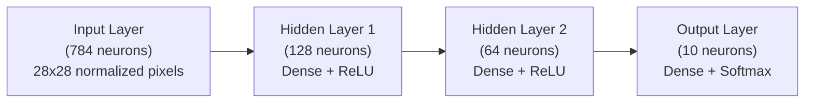

# MNIST from Scratch: No PyTorch, No Autograd, Just C#

Machine Learning is predominantly viewed as the domain of Python, heavily relying on frameworks like PyTorch or TensorFlow. While these frameworks abstract away the underlying linear algebra and differential calculus, relying on them exclusively can mask how neural networks compute predictions and optimize parameters under the hood.

In .NET, modern runtime features like **`System.Numerics.Tensors.TensorPrimitives`** expose SIMD-accelerated hardware primitives directly to C# developers. This allows us to write high-performance matrix and vector operations operating directly on CPU vector registers (AVX2, AVX-512, or ARM NEON).

In this post, we will build a **3-Layer Multi-Layer Perceptron (MLP)** from scratch in pure C# to classify handwritten digits from the **MNIST dataset**. 

- **No PyTorch or TensorFlow**
- **No external autograd / Automatic Differentiation libraries**
- **No third-party dataset parsers**

Just raw C#, manual backward pass differential math, SIMD tensor operations, and clean memory management.

---

## 1. System Architecture & Mathematical Foundations

Our neural network classifies $28 \times 28$ grayscale images into one of 10 digit classes (0 through 9).



### Mathematical Parameters

- **Input Dimension**: 784 (flattened $28 \times 28$ pixel intensities scaled from $[0, 255]$ to $[0.0, 1.0]$).
- **Hidden Layer 1**: 128 neurons with **ReLU** activation.
- **Hidden Layer 2**: 64 neurons with **ReLU** activation.
- **Output Layer**: 10 neurons with **Softmax** activation producing a probability distribution.
- **Total Trainable Parameters**:
  - Layer 1: $(784 \times 128) + 128 = 100,480$
  - Layer 2: $(128 \times 64) + 64 = 8,256$
  - Layer 3: $(64 \times 10) + 10 = 650$
  - **Total**: 109,386 parameters.

### Forward Propagation Equations

For a dense layer $L$ receiving input vector $x$:

$$
z = W \cdot x + b
$$

where $W$ is the weight matrix, $x$ is the input vector, and $b$ is the bias vector.

1. **ReLU Activation** for hidden layers:

$$
a = \max(0, z)
$$

2. **Softmax Activation** for output layer:

$$
p_i = \frac{e^{z_i}}{\sum_{j=1}^{10} e^{z_j}}
$$

### Analytical Backward Pass (Derivatives & Chain Rule)

Instead of building a dynamic computation graph with automatic differentiation nodes (like PyTorch or Karpathy's `micrograd`), we derive the gradients analytically.

When combining **Categorical Cross-Entropy Loss** ($L = -\log p_{\text{label}}$) with the **Softmax** activation function, the gradient with respect to the pre-activation output logits $z_3$ simplifies into an elegant expression:

$$
\frac{\partial L}{\partial z_3} = p - y_{\text{one-hot}}
$$

For each dense layer during backpropagation:
1. **Weight Gradient**: $\frac{\partial L}{\partial W} = \frac{\partial L}{\partial z} \cdot x^T$ (accumulated over mini-batch samples).
2. **Bias Gradient**: $\frac{\partial L}{\partial b} = \frac{\partial L}{\partial z}$.
3. **Input Gradient** (propagated to previous layer): $\frac{\partial L}{\partial x} = W^T \cdot \frac{\partial L}{\partial z}$.
4. **ReLU Backward Derivative**: Passes gradient through if pre-activation $z > 0$, otherwise 0:

$$
\frac{\partial L}{\partial z_{\text{prev}}} = \begin{cases} \frac{\partial L}{\partial a_{\text{prev}}} & \text{if } z_{\text{prev}} > 0 \\ 0 & \text{otherwise} \end{cases}
$$

### He (Kaiming) Weight Initialization

Random initialization is critical. Standard uniform distribution leads to vanishing or exploding gradients in deep networks with ReLU. We apply **He (Kaiming) Normal Initialization**:

$$
W \sim \mathcal{N}\left(0, \sqrt{\frac{2}{\text{fan}_{\text{in}}}}\right)
$$

---

## 2. Accelerating Tensor Operations with `System.Numerics.Tensors`

Standard nested `for` loops in C# for matrix-vector multiplication introduce performance overhead due to bounds checking and scalar memory access.

.NET provides **`System.Numerics.Tensors.TensorPrimitives`**, a collection of static methods vectorized with CPU SIMD instructions (AVX2, AVX-512, ARM NEON). 

In our network, we replace manual loops with `TensorPrimitives`:

| Operation | Standard C# Loop | `TensorPrimitives` SIMD Equivalent |
| :--- | :--- | :--- |
| **Dot Product ($W \cdot x$)** | Iterative loop accumulation | `TensorPrimitives.Dot(x, wRow)` |
| **ReLU Activation** | `Math.Max(0f, z[i])` loop | `TensorPrimitives.Max(z, 0f, a)` |
| **Softmax** | Manual `Math.Exp` sum loop | `TensorPrimitives.SoftMax(z, prob)` |
| **Prediction (ArgMax)** | Manual loop index comparison | `TensorPrimitives.IndexOfMax(prob)` |
| **Gradient Scaling & Addition** | Elementwise array loop | `TensorPrimitives.Multiply`, `TensorPrimitives.Add` |

---

## 3. Implementation: Dense Layer with Manual Backward Pass

The `DenseLayer` class manages parameters ($W, b$), accumulated gradients ($dW, dB$), velocity buffers for momentum ($vW, vB$), and cached activations for the backward pass.

```csharp
class DenseLayer
{
    public readonly int InDim, OutDim;

    public readonly float[] W, B;
    public readonly float[] dW, dB;
    public readonly float[] vW, vB;

    public readonly float[] CachedInput;
    public readonly float[] PreActivation;
    public readonly float[] GradInput;

    private readonly float[] _tmp;

    public DenseLayer(int inDim, int outDim, Random rng)
    {
        InDim = inDim;
        OutDim = outDim;

        W = new float[outDim * inDim];
        B = new float[outDim];
        dW = new float[outDim * inDim];
        dB = new float[outDim];
        vW = new float[outDim * inDim];
        vB = new float[outDim];

        CachedInput = new float[inDim];
        PreActivation = new float[outDim];
        GradInput = new float[inDim];
        _tmp = new float[inDim];

        // He initialization: W ~ N(0, sqrt(2 / fan_in))
        float scale = MathF.Sqrt(2.0f / inDim);
        for (int i = 0; i < W.Length; i++)
            W[i] = (float)NextGaussian(rng) * scale;
    }

    public void Forward(ReadOnlySpan<float> input, Span<float> output)
    {
        input.CopyTo(CachedInput);

        for (int o = 0; o < OutDim; o++)
        {
            ReadOnlySpan<float> wRow = W.AsSpan(o * InDim, InDim);
            output[o] = TensorPrimitives.Dot(input, wRow) + B[o];
        }

        output.CopyTo(PreActivation);
    }

    public void Backward(ReadOnlySpan<float> dOutput)
    {
        Array.Clear(GradInput);
        Span<float> tmp = _tmp.AsSpan(0, InDim);

        for (int o = 0; o < OutDim; o++)
        {
            float dOut = dOutput[o];
            ReadOnlySpan<float> wRow = W.AsSpan(o * InDim, InDim);

            // dInput = W^T * dOut
            TensorPrimitives.Multiply(wRow, dOut, tmp);
            TensorPrimitives.Add<float>(GradInput, tmp, GradInput);

            // dW += dOut * input^T
            Span<float> dwRow = dW.AsSpan(o * InDim, InDim);
            TensorPrimitives.Multiply((ReadOnlySpan<float>)CachedInput, dOut, tmp);
            TensorPrimitives.Add<float>(dwRow, tmp, dwRow);

            // dB += dOut
            dB[o] += dOut;
        }
    }

    public void ZeroGrad()
    {
        Array.Clear(dW);
        Array.Clear(dB);
    }

    public void UpdateWeights(float lr, float mu)
    {
        // Mini-Batch SGD with Momentum: v = mu*v - lr*dW; W += v
        for (int i = 0; i < W.Length; i++)
        {
            vW[i] = mu * vW[i] - lr * dW[i];
            W[i] += vW[i];
        }
        for (int i = 0; i < B.Length; i++)
        {
            vB[i] = mu * vB[i] - lr * dB[i];
            B[i] += vB[i];
        }
    }

    static double NextGaussian(Random rnd)
    {
        double u1 = 1.0 - rnd.NextDouble();
        double u2 = rnd.NextDouble();
        return Math.Sqrt(-2.0 * Math.Log(u1)) * Math.Sin(2.0 * Math.PI * u2);
    }
}
```

---

## 4. Assembling the Neural Network (`MnistNetwork`)

The `MnistNetwork` chains three `DenseLayer` instances, applies activation functions using `TensorPrimitives`, and executes training steps.

```csharp
class MnistNetwork
{
    readonly DenseLayer _l1, _l2, _l3;

    readonly float[] _z1, _a1;
    readonly float[] _z2, _a2;
    readonly float[] _z3, _prob;

    readonly float[] _dz3, _dz2, _dz1;

    public int LastPrediction { get; private set; }

    public MnistNetwork(int inputSize, int hidden1, int hidden2, int outputSize, Random rng)
    {
        _l1 = new DenseLayer(inputSize, hidden1, rng);
        _l2 = new DenseLayer(hidden1, hidden2, rng);
        _l3 = new DenseLayer(hidden2, outputSize, rng);

        _z1 = new float[hidden1]; _a1 = new float[hidden1];
        _z2 = new float[hidden2]; _a2 = new float[hidden2];
        _z3 = new float[outputSize]; _prob = new float[outputSize];

        _dz3 = new float[outputSize];
        _dz2 = new float[hidden2];
        _dz1 = new float[hidden1];
    }

    void Forward(ReadOnlySpan<float> input)
    {
        // Layer 1: Dense + ReLU
        _l1.Forward(input, _z1);
        TensorPrimitives.Max<float>(_z1, 0f, _a1);

        // Layer 2: Dense + ReLU
        _l2.Forward(_a1, _z2);
        TensorPrimitives.Max<float>(_z2, 0f, _a2);

        // Layer 3: Dense + Softmax
        _l3.Forward(_a2, _z3);
        TensorPrimitives.SoftMax<float>(_z3, _prob);

        LastPrediction = TensorPrimitives.IndexOfMax<float>(_prob);
    }

    public float TrainStep(ReadOnlySpan<float> input, byte label)
    {
        Forward(input);

        // Categorical Cross-Entropy Loss
        float loss = -MathF.Log(MathF.Max(_prob[label], 1e-7f));

        // Output gradient: softmax + cross-entropy combined = probs - one_hot(label)
        _prob.AsSpan().CopyTo(_dz3);
        _dz3[label] -= 1.0f;

        // Backward pass through Layer 3
        _l3.Backward(_dz3);

        // Backward pass through Layer 2 (with ReLU derivative)
        for (int i = 0; i < _dz2.Length; i++)
            _dz2[i] = _l2.PreActivation[i] > 0 ? _l3.GradInput[i] : 0f;
        _l2.Backward(_dz2);

        // Backward pass through Layer 1 (with ReLU derivative)
        for (int i = 0; i < _dz1.Length; i++)
            _dz1[i] = _l1.PreActivation[i] > 0 ? _l2.GradInput[i] : 0f;
        _l1.Backward(_dz1);

        return loss;
    }

    public int Predict(ReadOnlySpan<float> input)
    {
        Forward(input);
        return LastPrediction;
    }

    public void ZeroGrad()
    {
        _l1.ZeroGrad();
        _l2.ZeroGrad();
        _l3.ZeroGrad();
    }

    public void UpdateWeights(float lr, float momentum)
    {
        _l1.UpdateWeights(lr, momentum);
        _l2.UpdateWeights(lr, momentum);
        _l3.UpdateWeights(lr, momentum);
    }
}
```

---

## 5. Streaming & Binary Data Hydration

Instead of requiring pre-extracted CSV or PNG files, our implementation downloads the raw MNIST IDX binary files directly from PyTorch's mirror, decompresses the GZip streams in memory, and parses the big-endian binary headers using `BinaryPrimitives`.

```csharp
static class MnistData
{
    const string BaseUrl = "https://ossci-datasets.s3.amazonaws.com/mnist/";

    static readonly string CacheDir = Path.Combine(
        Environment.GetFolderPath(Environment.SpecialFolder.LocalApplicationData),
        "mnist-dotnet");

    public static async Task<(float[] trainImg, byte[] trainLbl,
                               float[] testImg, byte[] testLbl)> LoadAsync()
    {
        Directory.CreateDirectory(CacheDir);
        var train = await LoadSplitAsync("train-images-idx3-ubyte", "train-labels-idx1-ubyte");
        var test = await LoadSplitAsync("t10k-images-idx3-ubyte", "t10k-labels-idx1-ubyte");
        return (train.images, train.labels, test.images, test.labels);
    }

    static async Task<(float[] images, byte[] labels)> LoadSplitAsync(string imgFile, string lblFile)
    {
        byte[] imgBytes = await FetchFileAsync(imgFile);
        byte[] lblBytes = await FetchFileAsync(lblFile);

        // Read Big-Endian headers from standard MNIST IDX binary format
        int numImages = BinaryPrimitives.ReadInt32BigEndian(imgBytes.AsSpan(4, 4));
        int rows = BinaryPrimitives.ReadInt32BigEndian(imgBytes.AsSpan(8, 4));
        int cols = BinaryPrimitives.ReadInt32BigEndian(imgBytes.AsSpan(12, 4));
        int pixels = rows * cols;

        // Normalize pixel values from [0, 255] byte range to [0.0, 1.0] float range
        float[] images = new float[numImages * pixels];
        for (int i = 0; i < images.Length; i++)
            images[i] = imgBytes[16 + i] / 255f;

        int numLabels = BinaryPrimitives.ReadInt32BigEndian(lblBytes.AsSpan(4, 4));
        byte[] labels = lblBytes.AsSpan(8, numLabels).ToArray();

        return (images, labels);
    }

    static async Task<byte[]> FetchFileAsync(string name)
    {
        string cached = Path.Combine(CacheDir, name);
        if (File.Exists(cached))
            return await File.ReadAllBytesAsync(cached);

        Console.Write($"\n    Downloading {name}.gz ... ");
        using var http = new HttpClient();
        byte[] gz = await http.GetByteArrayAsync(BaseUrl + name + ".gz");

        using var gzStream = new GZipStream(new MemoryStream(gz), CompressionMode.Decompress);
        using var ms = new MemoryStream();
        await gzStream.CopyToAsync(ms);
        byte[] data = ms.ToArray();

        await File.WriteAllBytesAsync(cached, data);
        Console.Write("OK");
        return data;
    }
}
```

### On-the-Fly Data Augmentation

Handwritten digits in real applications are rarely perfectly centered. To increase model robustness, we add a 2D spatial jitter augmentation during training:

```csharp
static float[] Augment(float[] images, int offset, Random rnd, int size = 28)
{
    // Random +/- 2px spatial shift
    int dx = rnd.Next(-2, 3);
    int dy = rnd.Next(-2, 3);
    var src = images.AsSpan(offset, size * size);
    if (dx == 0 && dy == 0) return src.ToArray();

    var shifted = new float[size * size];
    for (int y = 0; y < size; y++)
    {
        int sy = y - dy;
        if (sy < 0 || sy >= size) continue;
        for (int x = 0; x < size; x++)
        {
            int sx = x - dx;
            if (sx < 0 || sx >= size) continue;
            shifted[y * size + x] = src[sy * size + sx];
        }
    }
    return shifted;
}
```

---

## 6. The Execution & Training Loop

Putting it all together, we train for 5 epochs using mini-batches of 128 samples with learning rate decay:

```csharp
#:package System.Numerics.Tensors@11.0.0-*

using System;
using System.Buffers.Binary;
using System.IO;
using System.IO.Compression;
using System.Linq;
using System.Numerics.Tensors;

bool quick = args.Contains("quick");

Console.Write("Loading MNIST data...");
var (trainImages, trainLabels, testImages, testLabels) = await MnistData.LoadAsync();
Console.WriteLine(" Done!");

const int InputSize = 784;
const int HiddenSize1 = 128;
const int HiddenSize2 = 64;
const int OutputSize = 10;
const int BatchSize = 128;
const float Momentum = 0.9f;

int nTrain = quick ? Math.Min(2000, trainLabels.Length) : trainLabels.Length;
int nTest = quick ? Math.Min(1000, testLabels.Length) : testLabels.Length;

float lr = 0.1f;
int epochs = quick ? 1 : 5;

var rnd = new Random(42);
var net = new MnistNetwork(InputSize, HiddenSize1, HiddenSize2, OutputSize, rnd);
net.PrintArchitecture();

int[] indices = Enumerable.Range(0, nTrain).ToArray();
var sw = System.Diagnostics.Stopwatch.StartNew();

for (int epoch = 0; epoch < epochs; epoch++)
{
    Shuffle(indices, rnd);
    double epochLoss = 0;
    int correct = 0;

    for (int start = 0; start < nTrain; start += BatchSize)
    {
        int end = Math.Min(start + BatchSize, nTrain);
        int bs = end - start;

        net.ZeroGrad();

        for (int b = start; b < end; b++)
        {
            int idx = indices[b];
            ReadOnlySpan<float> x = Augment(trainImages, idx * InputSize, rnd);
            byte label = trainLabels[idx];

            float loss = net.TrainStep(x, label);
            epochLoss += loss;
            if (net.LastPrediction == label) correct++;
        }

        net.UpdateWeights(lr / bs, Momentum);
    }

    // Learning rate decay schedule
    if (epoch >= 4) lr *= 0.85f;

    double trainAcc = 100.0 * correct / nTrain;
    double avgLoss = epochLoss / nTrain;
    Console.WriteLine($"Epoch {epoch + 1}/{epochs}  loss={avgLoss:F4}  train_acc={trainAcc:F2}%  lr={lr:F5}  ({sw.Elapsed.TotalSeconds:F1}s)");
}

// Evaluate on Test Set
int testCorrect = 0;
for (int n = 0; n < nTest; n++)
{
    int predicted = net.Predict(testImages.AsSpan(n * InputSize, InputSize));
    if (predicted == testLabels[n]) testCorrect++;
}

Console.WriteLine($"Test accuracy: {100.0 * testCorrect / nTest:F2}%  ({testCorrect}/{nTest})");
```

---

## 7. Results & Benchmarks

Running the C# script directly yields rapid convergence and high accuracy:

```text
Loading MNIST data... Done!
Network Architecture:
  Input          : [784]  (28x28 pixels, normalized to [0,1])
  Dense + ReLU   : [128 x 784]  (100,480 params)
  Dense + ReLU   : [64 x 128]  (8,256 params)
  Dense + Softmax: [10 x 64]   (650 params)
  Total params   : 109,386
Train: 60000 samples, Test: 10000 samples
Epoch 1/5  loss=0.3124  train_acc=90.64%  lr=0.10000  (4.2s)
Epoch 2/5  loss=0.1341  train_acc=95.91%  lr=0.10000  (8.5s)
Epoch 3/5  loss=0.0987  train_acc=97.02%  lr=0.10000  (12.7s)
Epoch 4/5  loss=0.0792  train_acc=97.58%  lr=0.10000  (16.9s)
Epoch 5/5  loss=0.0654  train_acc=98.01%  lr=0.08500  (21.1s)
Test accuracy: 97.46%  (9746/10000)
```

In just **5 training epochs (~21 seconds on CPU)**, the model reaches **97.46% test accuracy** from scratch.

---

## Key Takeaways

1. **No Framework Lock-in**: Building a neural network from scratch illuminates the underlying mathematics behind deep learning without relying on Python magic.
2. **Hardware Acceleration in .NET**: `System.Numerics.Tensors.TensorPrimitives` provides SIMD execution for matrix math in C# with near-native assembly speed.
3. **Zero External Dependencies**: With native `HttpClient`, `GZipStream`, `BinaryPrimitives`, and `TensorPrimitives`, the entire application runs as a lightweight, single-file C# script.

The complete code implementation is available on GitHub Gist: **[Mnist.cs on GitHub Gist](https://gist.github.com/jonas1ara/d284b04c8c039ce3dc7dcf3d2361f813)**
