```mermaid
graph LR
    subgraph Input ["Input Layer"]
        X["Input x<br/>(784 pixels)"]
    end

    subgraph Hidden1 ["Hidden Layer 1 (128 units)"]
        Z1["z₁ = W₁x + b₁<br/>(TensorPrimitives.Dot)"]
        A1["a₁ = ReLU(z₁)<br/>(TensorPrimitives.Max)"]
    end

    subgraph Hidden2 ["Hidden Layer 2 (64 units)"]
        Z2["z₂ = W₂a₁ + b₂<br/>(TensorPrimitives.Dot)"]
        A2["a₂ = ReLU(z₂)<br/>(TensorPrimitives.Max)"]
    end

    subgraph Output ["Output Layer (10 units)"]
        Z3["z₃ = W₃a₂ + b₃<br/>(TensorPrimitives.Dot)"]
        Prob["p = SoftMax(z₃)<br/>(TensorPrimitives.SoftMax)"]
    end

    subgraph Loss ["Loss Computation"]
        L["Loss = -ln(p[y])<br/>(Cross-Entropy)"]
    end

    X --> Z1 --> A1 --> Z2 --> A2 --> Z3 --> Prob --> L

    classDef tensor fill:#1e293b,stroke:#38bdf8,stroke-width:2px,color:#f8fafc;
    classDef act fill:#0f172a,stroke:#f59e0b,stroke-width:2px,color:#f8fafc;
    classDef loss fill:#31102b,stroke:#ec4899,stroke-width:2px,color:#f8fafc;
    class X,Z1,Z2,Z3,Prob tensor;
    class A1,A2 act;
    class L loss;
```

# MNIST from Scratch: No PyTorch, No Autograd, Just C#

In modern deep learning, training a neural network on the classic MNIST dataset usually takes fewer than ten lines of Python:

```python
# The standard modern abstraction curtain
import torch, torch.nn as nn
model = nn.Sequential(nn.Linear(784, 128), nn.ReLU(), nn.Linear(128, 64), nn.ReLU(), nn.Linear(64, 10))
# ... forward, loss.backward(), optimizer.step()
```

Libraries like PyTorch, TensorFlow, and TorchSharp are incredible feats of engineering. They handle memory allocations, dynamic computation graphs, automatic differentiation (autograd), and hardware kernel dispatches.

However, relying entirely on these black boxes can obscure what a neural network actually is: **a sequence of parameterized matrix transformations, non-linear activations, and multivariate calculus executed via the chain rule**.

In this post, we build and train a multi-layer perceptron (MLP) on MNIST from pure first principles in **C# (.NET 9 / .NET 10 preview)** using **`System.Numerics.Tensors`**:

1. **No PyTorch, TorchSharp, or ML Frameworks**: Every layer, activation, and optimization step is built from scratch.
2. **No Autograd Engine**: No dynamic graph tapes or reverse-mode automatic differentiation trees. We derive and implement the exact **analytical partial derivatives** directly.
3. **Powered by `TensorPrimitives`**: Instead of hand-rolling scalar loops or platform-specific AVX intrinsics, we leverage the SIMD-accelerated linear algebra operations built natively into modern .NET.
4. **Self-Contained Data Pipeline**: We automatically fetch the official MNIST dataset from PyTorch's S3 mirror, decompress `.gz` archives on the fly with `GZipStream`, cache them locally in `%LOCALAPPDATA%`, and parse the Big-Endian binary IDX format with `BinaryPrimitives`.
5. **Data Augmentation & Momentum SGD**: We implement spatial jittering ($\pm 2\text{px}$ random shifts) to overcome MLP spatial rigidity, paired with mini-batch Stochastic Gradient Descent with Momentum ($\mu = 0.9$).

---

## 1. Network Architecture & Problem Formulation

The MNIST problem consists of classifying $28 \times 28$ grayscale images of handwritten digits into 10 classes (`0` through `9`).



### Architecture Specifications
- **Input $\mathbf{x}$**: Flattened 784-element vector ($\mathbf{x} \in [0, 1]^{784}$).
- **Layer 1**: Dense $784 \to 128$, Activation: **ReLU** ($100{,}480$ parameters).
- **Layer 2**: Dense $128 \to 64$, Activation: **ReLU** ($8{,}256$ parameters).
- **Layer 3**: Dense $64 \to 10$, Activation: **Softmax** ($650$ parameters).
- **Total Parameters**: **$109{,}386$ trainable floats**.

---

## 2. Deriving the Manual Backward Pass (No Autograd)

To train the network without an autograd engine, we must analytically derive how the loss function $L$ changes with respect to every weight $W$ and bias $b$ across all layers.

### 2.1 The Softmax + Cross-Entropy Simplification

Let $\mathbf{z}_3 \in \mathbb{R}^{10}$ be the pre-activation logits of the output layer. The predicted probability distribution $\mathbf{p} \in \Delta^9$ is computed via Softmax:

$$p_i = \text{Softmax}(\mathbf{z}_3)_i = \frac{e^{z_{3,i}}}{\sum_{j=0}^{9} e^{z_{3,j}}}$$

The Categorical Cross-Entropy loss for true label $y \in \{0, \dots, 9\}$ (represented as a one-hot vector $\mathbf{t}$ where $t_y = 1$ and $t_{k \neq y} = 0$) is:

$$L = -\ln(p_y) = -\sum_{k=0}^{9} t_k \ln(p_k)$$

When we compute the partial derivative of $L$ with respect to the logit $z_{3,i}$:

$$\frac{\partial L}{\partial z_{3,i}} = \sum_{k=0}^{9} \frac{\partial L}{\partial p_k} \frac{\partial p_k}{\partial z_{3,i}}$$

Using the quotient rule on the Softmax function:

$$\frac{\partial p_k}{\partial z_{3,i}} = \begin{cases} p_i(1 - p_i) & \text{if } i = k \\ -p_k p_i & \text{if } i \neq k \end{cases}$$

Substituting $\frac{\partial L}{\partial p_k} = -\frac{t_k}{p_k}$:

$$\frac{\partial L}{\partial z_{3,i}} = -\frac{t_i}{p_i} \cdot p_i(1 - p_i) - \sum_{k \neq i} \frac{t_k}{p_k} \cdot (-p_k p_i) = -t_i + t_i p_i + p_i \sum_{k \neq i} t_k$$

Since $\mathbf{t}$ is a one-hot vector, $\sum_{\text{all } k} t_k = 1$, which simplifies to:

$$\mathbf{\delta}_3 = \frac{\partial L}{\partial \mathbf{z}_3} = \mathbf{p} - \mathbf{t}$$

> [!NOTE]
> The analytical derivative of the combined Softmax + Cross-Entropy loss is simply the **prediction error** $(\mathbf{p} - \mathbf{t})$. In code, this takes just two lines:
> ```csharp
> _prob.AsSpan().CopyTo(_dz3);
> _dz3[label] -= 1.0f;
> ```

---

### 2.2 Layer-by-Layer Backward Propagation

For any dense linear transformation $\mathbf{z} = W \mathbf{x} + \mathbf{b}$, given the incoming error vector $\mathbf{\delta} = \frac{\partial L}{\partial \mathbf{z}}$ from the layer above:

1. **Weight Gradient ($\nabla W$)**: Outer product of the incoming error and the cached input:
   $$\frac{\partial L}{\partial W} = \mathbf{\delta} \mathbf{x}^T \quad \implies \quad dW_{ij} = \delta_i \cdot x_j$$
2. **Bias Gradient ($\nabla \mathbf{b}$)**:
   $$\frac{\partial L}{\partial \mathbf{b}} = \mathbf{\delta}$$
3. **Propagating Error to the Previous Layer ($d\text{Input}$)**: By the chain rule, the gradient with respect to the input vector $\mathbf{x}$ is the transpose matrix multiplication:
   $$\mathbf{\delta}_{\text{in}} = \frac{\partial L}{\partial \mathbf{x}} = W^T \mathbf{\delta}$$
4. **Propagating Through ReLU**:
   $$\text{ReLU}'(z) = \begin{cases} 1 & \text{if } z > 0 \\ 0 & \text{if } z \le 0 \end{cases} \quad \implies \quad \mathbf{\delta}_{\text{prev}} = \mathbf{\delta}_{\text{in}} \odot \mathbb{I}(\mathbf{z}_{\text{prev}} > 0)$$

---

## 3. The Secret Weapon: `System.Numerics.Tensors` & `TensorPrimitives`

Historically, high-performance ML in C# required writing nested loops with `System.Numerics.Vector<T>` or calling unmanaged native BLAS libraries.

Starting in modern .NET, **`System.Numerics.Tensors`** provides **`TensorPrimitives`**, a collection of static methods that execute SIMD-accelerated tensor math directly over `Span<float>` and `ReadOnlySpan<float>` with zero allocations:

| Mathematical Operation | `TensorPrimitives` Method | Underlying Acceleration |
| :--- | :--- | :--- |
| **Matrix-Vector Dot Product** | `TensorPrimitives.Dot(input, wRow)` | AVX2 / AVX-512 FMA / ARM Neon |
| **ReLU Activation** | `TensorPrimitives.Max(z, 0f, a)` | Vectorized element-wise max |
| **Softmax** | `TensorPrimitives.SoftMax(z, prob)` | Numerically stable SIMD exponentiation & sum |
| **Prediction (ArgMax)** | `TensorPrimitives.IndexOfMax(prob)` | SIMD scan for maximum element |
| **Vector Add / Multiply** | `TensorPrimitives.Add`, `Multiply` | Vectorized in-place gradient accumulation |

---

## 4. Implementation: The `DenseLayer`

Each dense layer encapsulates its weights $W$, biases $B$, accumulated mini-batch gradients $dW, dB$, momentum velocities $vW, vB$, and pre-allocated cached buffers for forward and backward passes.

```csharp
class DenseLayer
{
    public readonly int InDim, OutDim;

    public readonly float[] W, B;
    public readonly float[] dW, dB;
    public readonly float[] vW, vB;

    public readonly float[] CachedInput;
    public readonly float[] PreActivation;
    public readonly float[] GradInput;

    private readonly float[] _tmp;

    public DenseLayer(int inDim, int outDim, Random rng)
    {
        InDim = inDim;
        OutDim = outDim;

        W = new float[outDim * inDim];
        B = new float[outDim];
        dW = new float[outDim * inDim];
        dB = new float[outDim];
        vW = new float[outDim * inDim];
        vB = new float[outDim];

        CachedInput = new float[inDim];
        PreActivation = new float[outDim];
        GradInput = new float[inDim];
        _tmp = new float[inDim];

        // He (Kaiming) initialization: W ~ N(0, sqrt(2 / fan_in))
        float scale = MathF.Sqrt(2.0f / inDim);
        for (int i = 0; i < W.Length; i++)
            W[i] = (float)NextGaussian(rng) * scale;
    }

    public void Forward(ReadOnlySpan<float> input, Span<float> output)
    {
        input.CopyTo(CachedInput);

        for (int o = 0; o < OutDim; o++)
        {
            ReadOnlySpan<float> wRow = W.AsSpan(o * InDim, InDim);
            output[o] = TensorPrimitives.Dot(input, wRow) + B[o];
        }

        output.CopyTo(PreActivation);
    }

    public void Backward(ReadOnlySpan<float> dOutput)
    {
        Array.Clear(GradInput);
        Span<float> tmp = _tmp.AsSpan(0, InDim);

        for (int o = 0; o < OutDim; o++)
        {
            float dOut = dOutput[o];
            ReadOnlySpan<float> wRow = W.AsSpan(o * InDim, InDim);

            // GradInput += W^T * dOutput
            TensorPrimitives.Multiply(wRow, dOut, tmp);
            TensorPrimitives.Add<float>(GradInput, tmp, GradInput);

            // Accumulate dW += dOutput (outer product) CachedInput
            Span<float> dwRow = dW.AsSpan(o * InDim, InDim);
            TensorPrimitives.Multiply((ReadOnlySpan<float>)CachedInput, dOut, tmp);
            TensorPrimitives.Add<float>(dwRow, tmp, dwRow);

            // Accumulate dB += dOutput
            dB[o] += dOut;
        }
    }

    public void ZeroGrad()
    {
        Array.Clear(dW);
        Array.Clear(dB);
    }

    public void UpdateWeights(float lr, float mu)
    {
        // Mini-batch SGD with Momentum: v = mu * v - lr * dW; W += v
        for (int i = 0; i < W.Length; i++)
        {
            vW[i] = mu * vW[i] - lr * dW[i];
            W[i] += vW[i];
        }
        for (int i = 0; i < B.Length; i++)
        {
            vB[i] = mu * vB[i] - lr * dB[i];
            B[i] += vB[i];
        }
    }

    static double NextGaussian(Random rnd)
    {
        // Box-Muller transform for normal distribution sampling
        double u1 = 1.0 - rnd.NextDouble();
        double u2 = rnd.NextDouble();
        return Math.Sqrt(-2.0 * Math.Log(u1)) * Math.Sin(2.0 * Math.PI * u2);
    }
}
```

---

## 5. Network Orchestration: `MnistNetwork`

The `MnistNetwork` orchestrates the three layers, chains forward activations, propagates gradients backward through the ReLU gates, and outputs predictions.

```csharp
class MnistNetwork
{
    readonly DenseLayer _l1, _l2, _l3;

    readonly float[] _z1, _a1;
    readonly float[] _z2, _a2;
    readonly float[] _z3, _prob;

    readonly float[] _dz3, _dz2, _dz1;

    public int LastPrediction { get; private set; }

    public MnistNetwork(int inputSize, int hidden1, int hidden2, int outputSize, Random rng)
    {
        _l1 = new DenseLayer(inputSize, hidden1, rng);
        _l2 = new DenseLayer(hidden1, hidden2, rng);
        _l3 = new DenseLayer(hidden2, outputSize, rng);

        _z1 = new float[hidden1]; _a1 = new float[hidden1];
        _z2 = new float[hidden2]; _a2 = new float[hidden2];
        _z3 = new float[outputSize]; _prob = new float[outputSize];

        _dz3 = new float[outputSize];
        _dz2 = new float[hidden2];
        _dz1 = new float[hidden1];
    }

    public void PrintArchitecture()
    {
        var w1 = Tensor.Create<float>(_l1.W, [_l1.OutDim, _l1.InDim]);
        var w2 = Tensor.Create<float>(_l2.W, [_l2.OutDim, _l2.InDim]);
        var w3 = Tensor.Create<float>(_l3.W, [_l3.OutDim, _l3.InDim]);

        int totalParams = (int)(w1.FlattenedLength + w2.FlattenedLength + w3.FlattenedLength)
                        + _l1.B.Length + _l2.B.Length + _l3.B.Length;

        Console.WriteLine("Network Architecture:");
        Console.WriteLine($"  Input          : [{_l1.InDim}]  (28x28 pixels, normalized to [0,1])");
        Console.WriteLine($"  Dense + ReLU   : [{string.Join(" x ", w1.Lengths.ToArray())}]  ({w1.FlattenedLength + _l1.B.Length:N0} params)");
        Console.WriteLine($"  Dense + ReLU   : [{string.Join(" x ", w2.Lengths.ToArray())}]  ({w2.FlattenedLength + _l2.B.Length:N0} params)");
        Console.WriteLine($"  Dense + Softmax: [{string.Join(" x ", w3.Lengths.ToArray())}]   ({w3.FlattenedLength + _l3.B.Length:N0} params)");
        Console.WriteLine($"  Total params   : {totalParams:N0}\n");
    }

    void Forward(ReadOnlySpan<float> input)
    {
        // 1. Layer 1 -> ReLU
        _l1.Forward(input, _z1);
        TensorPrimitives.Max<float>(_z1, 0f, _a1);

        // 2. Layer 2 -> ReLU
        _l2.Forward(_a1, _z2);
        TensorPrimitives.Max<float>(_z2, 0f, _a2);

        // 3. Layer 3 -> Softmax
        _l3.Forward(_a2, _z3);
        TensorPrimitives.SoftMax<float>(_z3, _prob);

        // ArgMax prediction
        LastPrediction = TensorPrimitives.IndexOfMax<float>(_prob);
    }

    public float TrainStep(ReadOnlySpan<float> input, byte label)
    {
        Forward(input);

        // Cross-Entropy Loss
        float loss = -MathF.Log(MathF.Max(_prob[label], 1e-7f));

        // Output gradient: dL/dz3 = prob - one_hot(label)
        _prob.AsSpan().CopyTo(_dz3);
        _dz3[label] -= 1.0f;

        // Backward through Layer 3
        _l3.Backward(_dz3);

        // Gate through ReLU 2 derivative: dz2 = GradInput * (z2 > 0)
        for (int i = 0; i < _dz2.Length; i++)
            _dz2[i] = _l2.PreActivation[i] > 0 ? _l3.GradInput[i] : 0f;
        _l2.Backward(_dz2);

        // Gate through ReLU 1 derivative: dz1 = GradInput * (z1 > 0)
        for (int i = 0; i < _dz1.Length; i++)
            _dz1[i] = _l1.PreActivation[i] > 0 ? _l2.GradInput[i] : 0f;
        _l1.Backward(_dz1);

        return loss;
    }

    public int Predict(ReadOnlySpan<float> input)
    {
        Forward(input);
        return LastPrediction;
    }

    public void ZeroGrad()
    {
        _l1.ZeroGrad();
        _l2.ZeroGrad();
        _l3.ZeroGrad();
    }

    public void UpdateWeights(float lr, float momentum)
    {
        _l1.UpdateWeights(lr, momentum);
        _l2.UpdateWeights(lr, momentum);
        _l3.UpdateWeights(lr, momentum);
    }

    public void SaveWeights(string path)
    {
        using var fs = new FileStream(path, FileMode.Create);
        using var bw = new BinaryWriter(fs);
        bw.Write(_l1.InDim);
        bw.Write(_l1.OutDim);
        bw.Write(_l2.OutDim);
        bw.Write(_l3.OutDim);
        foreach (var v in _l1.W) bw.Write(v);
        foreach (var v in _l1.B) bw.Write(v);
        foreach (var v in _l2.W) bw.Write(v);
        foreach (var v in _l2.B) bw.Write(v);
        foreach (var v in _l3.W) bw.Write(v);
        foreach (var v in _l3.B) bw.Write(v);
    }
}
```

---

## 6. Self-Contained Data Pipeline: `MnistData` & Augmentation

### 6.1 Big-Endian IDX Binary Parsing with Caching
The official MNIST dataset stores 32-bit integers in **Big-Endian** format. We use `BinaryPrimitives.ReadInt32BigEndian` to parse the headers, decompress on the fly via `GZipStream`, and persist decompressed files to `%LOCALAPPDATA%\mnist-dotnet` so downloads only execute once.

```csharp
static class MnistData
{
    const string BaseUrl = "https://ossci-datasets.s3.amazonaws.com/mnist/";

    static readonly string CacheDir = Path.Combine(
        Environment.GetFolderPath(Environment.SpecialFolder.LocalApplicationData),
        "mnist-dotnet");

    public static async Task<(float[] trainImg, byte[] trainLbl,
                               float[] testImg, byte[] testLbl)> LoadAsync()
    {
        Directory.CreateDirectory(CacheDir);

        var train = await LoadSplitAsync("train-images-idx3-ubyte", "train-labels-idx1-ubyte");
        var test = await LoadSplitAsync("t10k-images-idx3-ubyte", "t10k-labels-idx1-ubyte");

        return (train.images, train.labels, test.images, test.labels);
    }

    static async Task<(float[] images, byte[] labels)> LoadSplitAsync(string imgFile, string lblFile)
    {
        byte[] imgBytes = await FetchFileAsync(imgFile);
        byte[] lblBytes = await FetchFileAsync(lblFile);

        int numImages = BinaryPrimitives.ReadInt32BigEndian(imgBytes.AsSpan(4, 4));
        int rows = BinaryPrimitives.ReadInt32BigEndian(imgBytes.AsSpan(8, 4));
        int cols = BinaryPrimitives.ReadInt32BigEndian(imgBytes.AsSpan(12, 4));
        int pixels = rows * cols; // 784

        // Normalize pixel values from [0, 255] to [0.0, 1.0]
        float[] images = new float[numImages * pixels];
        for (int i = 0; i < images.Length; i++)
            images[i] = imgBytes[16 + i] / 255f;

        int numLabels = BinaryPrimitives.ReadInt32BigEndian(lblBytes.AsSpan(4, 4));
        byte[] labels = lblBytes.AsSpan(8, numLabels).ToArray();

        return (images, labels);
    }

    static async Task<byte[]> FetchFileAsync(string name)
    {
        string cached = Path.Combine(CacheDir, name);
        if (File.Exists(cached))
            return await File.ReadAllBytesAsync(cached);

        Console.Write($"\n    Downloading {name}.gz ... ");
        using var http = new HttpClient();
        byte[] gz = await http.GetByteArrayAsync(BaseUrl + name + ".gz");

        using var gzStream = new GZipStream(new MemoryStream(gz), CompressionMode.Decompress);
        using var ms = new MemoryStream();
        await gzStream.CopyToAsync(ms);
        byte[] data = ms.ToArray();

        await File.WriteAllBytesAsync(cached, data);
        Console.Write("OK");
        return data;
    }
}
```

### 6.2 Data Augmentation: Spatial Jitter
Unlike Convolutional Neural Networks (CNNs), standard Multi-Layer Perceptrons have **no translation invariance**. If a user draws a digit shifted 2 pixels to the left, the input activations hit completely different weights.

To solve this, we add an on-the-fly random spatial translation ($\pm 2\text{px}$ shift) during training:

```csharp
static float[] Augment(float[] images, int offset, Random rnd, int size = 28)
{
    // Random +/-2px shift so the MLP tolerates imperfect centering
    int dx = rnd.Next(-2, 3);
    int dy = rnd.Next(-2, 3);
    var src = images.AsSpan(offset, size * size);
    if (dx == 0 && dy == 0) return src.ToArray();

    var shifted = new float[size * size];
    for (int y = 0; y < size; y++)
    {
        int sy = y - dy;
        if (sy < 0 || sy >= size) continue;
        for (int x = 0; x < size; x++)
        {
            int sx = x - dx;
            if (sx < 0 || sx >= size) continue;
            shifted[y * size + x] = src[sy * size + sx];
        }
    }
    return shifted;
}
```

---

## 7. The Complete Training Loop

Putting everything together into a self-executing script (e.g. using `dotnet run` with top-level statements):

```csharp
#:package System.Numerics.Tensors@11.0.0-*

using System;
using System.Buffers.Binary;
using System.IO;
using System.IO.Compression;
using System.Linq;
using System.Numerics.Tensors;

bool quick = args.Contains("quick");

Console.Write("Loading MNIST data...");
var (trainImagesFull, trainLabelsFull, testImagesFull, testLabelsFull) = await MnistData.LoadAsync();
Console.WriteLine(" Done!");

const int InputSize = 784;
const int HiddenSize1 = 128;
const int HiddenSize2 = 64;
const int OutputSize = 10;
const int BatchSize = 128;
const float Momentum = 0.9f;

int nTrain = quick ? Math.Min(2000, trainLabelsFull.Length) : trainLabelsFull.Length;
int nTest = quick ? Math.Min(1000, testLabelsFull.Length) : testLabelsFull.Length;

Console.WriteLine($"Train: {nTrain} samples, Test: {nTest} samples\n");

float lr = 0.1f;
int epochs = quick ? 1 : 5;

var rnd = new Random(42);
var net = new MnistNetwork(InputSize, HiddenSize1, HiddenSize2, OutputSize, rnd);
net.PrintArchitecture();

int[] indices = Enumerable.Range(0, nTrain).ToArray();
var sw = System.Diagnostics.Stopwatch.StartNew();

for (int epoch = 0; epoch < epochs; epoch++)
{
    Shuffle(indices, rnd);
    double epochLoss = 0;
    int correct = 0;

    for (int start = 0; start < nTrain; start += BatchSize)
    {
        int end = Math.Min(start + BatchSize, nTrain);
        int bs = end - start;

        net.ZeroGrad();

        for (int b = start; b < end; b++)
        {
            int idx = indices[b];
            ReadOnlySpan<float> x = Augment(trainImagesFull, idx * InputSize, rnd);
            byte label = trainLabelsFull[idx];

            float loss = net.TrainStep(x, label);
            epochLoss += loss;
            if (net.LastPrediction == label) correct++;
        }

        // Average gradient update: lr / batchSize with momentum
        net.UpdateWeights(lr / bs, Momentum);
    }

    // Learning rate decay schedule
    if (epoch >= 4) lr *= 0.85f;

    double trainAcc = 100.0 * correct / nTrain;
    double avgLoss = epochLoss / nTrain;
    Console.WriteLine($"Epoch {epoch + 1:D2}/{epochs:D2}  loss={avgLoss:F4}  train_acc={trainAcc:F2}%  lr={lr:F5}  ({sw.Elapsed.TotalSeconds:F1}s)");
}

// Evaluate on unseen test set
int testCorrect = 0;
for (int n = 0; n < nTest; n++)
{
    int predicted = net.Predict(testImagesFull.AsSpan(n * InputSize, InputSize));
    if (predicted == testLabelsFull[n]) testCorrect++;
}

Console.WriteLine($"\nTest accuracy: {100.0 * testCorrect / nTest:F2}% ({testCorrect}/{nTest})");

if (!quick)
{
    string weightsPath = "weights.bin";
    net.SaveWeights(weightsPath);
    Console.WriteLine($"Weights saved to {Path.GetFullPath(weightsPath)}");
}

static void Shuffle(int[] arr, Random rnd)
{
    for (int i = arr.Length - 1; i > 0; i--)
    {
        int j = rnd.Next(i + 1);
        (arr[i], arr[j]) = (arr[j], arr[i]);
    }
}
```

---

## 8. Live Results & Training Metrics

Running the training process over 60,000 MNIST training samples:

```text
Loading MNIST data... Done!
Train: 60000 samples, Test: 10000 samples

Network Architecture:
  Input          : [784]  (28x28 pixels, normalized to [0,1])
  Dense + ReLU   : [128 x 784]  (100,480 params)
  Dense + ReLU   : [64 x 128]  (8,256 params)
  Dense + Softmax: [10 x 64]   (650 params)
  Total params   : 109,386

Epoch 01/05  loss=0.2941  train_acc=91.15%  lr=0.10000  (1.4s)
Epoch 02/05  loss=0.1348  train_acc=95.92%  lr=0.10000  (2.8s)
Epoch 03/05  loss=0.0987  train_acc=96.98%  lr=0.10000  (4.1s)
Epoch 04/05  loss=0.0812  train_acc=97.51%  lr=0.10000  (5.5s)
Epoch 05/05  loss=0.0684  train_acc=97.89%  lr=0.08500  (6.9s)

Test accuracy: 98.14% (9814/10000)
Weights saved to /home/jonas/Lab/mnist-dotnet/weights.bin
```

In just **5 epochs (~7 seconds total on CPU)**, the network crosses **98.1% accuracy on the test set**.

---

## Conclusion & Key Takeaways

1. **Neural Networks are Pure Applied Calculus**: Without autograd tapes or complex computation graphs, backpropagation is simply the multivariate chain rule: matrix-vector multiplications, element-wise gating, and outer-product accumulations.
2. **`System.Numerics.Tensors` is a Game Changer for .NET**: With `TensorPrimitives`, C# provides direct access to SIMD hardware acceleration without compromising memory safety or readability.
3. **Data Augmentation is Vital for MLPs**: A simple $\pm 2\text{px}$ random spatial translation dramatically improves test generalization on unseen hand-drawn digits.

---

### Resources & Gist
- The complete single-file C# implementation is available on GitHub Gist: **[jonas1ara/Mnist.cs](https://gist.github.com/jonas1ara/d284b04c8c039ce3dc7dcf3d2361f813)**.
