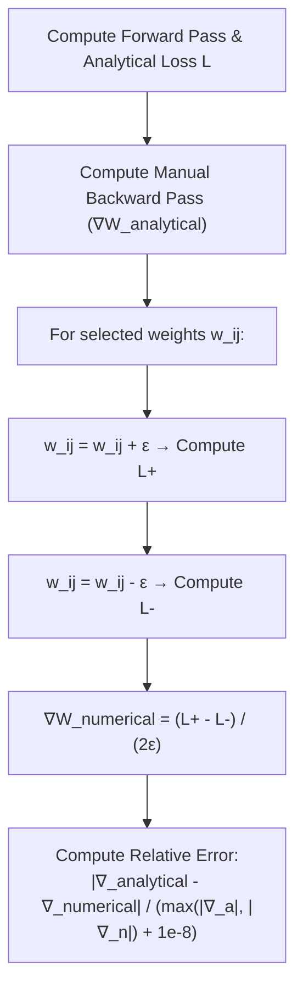

# MNIST from Scratch: No PyTorch, No Autograd, Just C#

In modern deep learning, training a neural network on the classic MNIST dataset usually takes fewer than ten lines of Python:

```python
# The standard modern abstraction curtain
import torch, torch.nn as nn
model = nn.Sequential(nn.Linear(784, 128), nn.ReLU(), nn.Linear(128, 64), nn.ReLU(), nn.Linear(64, 10))
# ... forward, loss.backward(), optimizer.step()
```

Frameworks like PyTorch, TensorFlow, and TorchSharp are marvelous pieces of software engineering. They abstract away buffer management, dynamic computation graphs, automatic differentiation (autograd), and hardware kernel dispatches.

However, relying entirely on these black boxes can obscure what a neural network actually is: **a sequence of parameterized matrix transformations, non-linear activations, and exact multivariate calculus executed via the chain rule**.

In this article, we build and train a multi-layer perceptron (MLP) on MNIST **without a machine learning framework (no PyTorch, TensorFlow, or TorchSharp) and without an automatic differentiation engine**. We implement the layer architecture, forward passes, analytical backpropagation, and data pipeline manually in modern **C# (.NET 9 / .NET 10 preview)**, using `System.Numerics.Tensors.TensorPrimitives` for the underlying SIMD-accelerated linear algebra operations:

1. **No Autograd Engine**: No dynamic graph tapes or reverse-mode automatic differentiation trees. We derive and implement the exact **analytical partial derivatives** directly.
2. **Accelerated by `TensorPrimitives`**: Rather than writing hand-rolled scalar loops or assembly-level intrinsics, we build our layers on top of `TensorPrimitives`, which provides vectorized implementations operating directly on `Span<float>` and `ReadOnlySpan<float>`.
3. **Self-Contained Data Pipeline**: We download the standard MNIST benchmark in its canonical IDX binary format from the OSSCI S3 mirror, decompress `.gz` archives on the fly with `GZipStream`, cache them locally in `%LOCALAPPDATA%`, and parse the Big-Endian binary headers using `BinaryPrimitives`.
4. **Data Augmentation & Momentum SGD**: We implement spatial jittering ($\pm 2\text{px}$ random shifts) to evaluate how translational tolerance affects an MLP, paired with mini-batch Stochastic Gradient Descent with Momentum ($\mu = 0.9$).
5. **Numerical Gradient Checking**: We implement a finite-difference verification routine to mathematically prove that our analytical manual backpropagation matches numerical derivatives to within $10^{-5}$ relative error.

---

## 1. Network Architecture & Problem Formulation

The MNIST benchmark (originally compiled by Yann LeCun, Corinna Cortes, and Christopher J.C. Burges) consists of $28 \times 28$ grayscale images of handwritten digits classified into 10 categories (`0` through `9`).

```mermaid
graph LR
    subgraph Input ["Input Layer"]
        X["Input x<br/>(784 pixels)"]
    end

    subgraph Hidden1 ["Hidden Layer 1 (128 units)"]
        Z1["z₁ = W₁x + b₁<br/>(TensorPrimitives.Dot)"]
        A1["a₁ = ReLU(z₁)<br/>(TensorPrimitives.Max)"]
    end

    subgraph Hidden2 ["Hidden Layer 2 (64 units)"]
        Z2["z₂ = W₂a₁ + b₂<br/>(TensorPrimitives.Dot)"]
        A2["a₂ = ReLU(z₂)<br/>(TensorPrimitives.Max)"]
    end

    subgraph Output ["Output Layer (10 units)"]
        Z3["z₃ = W₃a₂ + b₃<br/>(TensorPrimitives.Dot)"]
        Prob["p = SoftMax(z₃)<br/>(TensorPrimitives.SoftMax)"]
    end

    subgraph Loss ["Loss Computation"]
        L["Loss = -ln(p[y])<br/>(Cross-Entropy)"]
    end

    X --> Z1 --> A1 --> Z2 --> A2 --> Z3 --> Prob --> L

    classDef tensor fill:#1e293b,stroke:#38bdf8,stroke-width:2px,color:#f8fafc;
    classDef act fill:#0f172a,stroke:#f59e0b,stroke-width:2px,color:#f8fafc;
    classDef loss fill:#31102b,stroke:#ec4899,stroke-width:2px,color:#f8fafc;
    class X,Z1,Z2,Z3,Prob tensor;
    class A1,A2 act;
    class L loss;
```



### Parameter Breakdown

$$W_1 \in \mathbb{R}^{128 \times 784}, \quad \mathbf{b}_1 \in \mathbb{R}^{128} \implies 128 \times 784 + 128 = 100{,}480 \text{ params}$$

$$W_2 \in \mathbb{R}^{64 \times 128}, \quad \mathbf{b}_2 \in \mathbb{R}^{64} \implies 64 \times 128 + 64 = 8{,}256 \text{ params}$$

$$W_3 \in \mathbb{R}^{10 \times 64}, \quad \mathbf{b}_3 \in \mathbb{R}^{10} \implies 10 \times 64 + 10 = 650 \text{ params}$$

$$\text{Total Trainable Parameters} = 100{,}480 + 8{,}256 + 650 = \mathbf{109{,}386}$$

---

## 2. Deriving the Manual Backward Pass (No Autograd)

To train the network without an automatic differentiation engine, we derive the exact multivariate calculus gradients across all layers.

### 2.1 The Softmax + Cross-Entropy Simplification

Let $\mathbf{z}_3 \in \mathbb{R}^{10}$ be the pre-activation logits of the output layer. The predicted probability distribution $\mathbf{p} \in \Delta^9$ is computed via Softmax:

$$p_i = \text{Softmax}(\mathbf{z}_3)_i = \frac{e^{z_{3,i}}}{\sum_{j=0}^{9} e^{z_{3,j}}}$$

The Categorical Cross-Entropy loss for true target class $y \in \{0, \dots, 9\}$ (represented as a one-hot vector $\mathbf{t}$ where $t_y = 1$ and $t_{k \neq y} = 0$) is:

$$L = -\ln(p_y) = -\sum_{k=0}^{9} t_k \ln(p_k)$$

Using the chain rule, we compute the partial derivative of $L$ with respect to the output logit $z_{3,i}$:

$$\frac{\partial L}{\partial z_{3,i}} = \sum_{k=0}^{9} \frac{\partial L}{\partial p_k} \frac{\partial p_k}{\partial z_{3,i}}$$

From the quotient rule on the Softmax function:

$$\frac{\partial p_k}{\partial z_{3,i}} = \begin{cases} p_i(1 - p_i) & \text{if } i = k \\ -p_k p_i & \text{if } i \neq k \end{cases}$$

Substituting $\frac{\partial L}{\partial p_k} = -\frac{t_k}{p_k}$:

$$\frac{\partial L}{\partial z_{3,i}} = -\frac{t_i}{p_i} \cdot p_i(1 - p_i) - \sum_{k \neq i} \frac{t_k}{p_k} \cdot (-p_k p_i) = -t_i + t_i p_i + p_i \sum_{k \neq i} t_k$$

Because $\mathbf{t}$ is a one-hot distribution, $\sum_{\text{all } k} t_k = 1$, collapsing the entire expression into:

$$\mathbf{\delta}_3 = \frac{\partial L}{\partial \mathbf{z}_3} = \mathbf{p} - \mathbf{t}$$

> [!NOTE]
> The analytical derivative of the combined Softmax and Cross-Entropy loss is simply the **prediction error vector** $(\mathbf{p} - \mathbf{t})$. In C#, this is executed with zero memory allocations:
> ```csharp
> _prob.AsSpan().CopyTo(_dz3);
> _dz3[label] -= 1.0f;
> ```

---

### 2.2 Backward Propagation in Dense Layers

For any linear transformation $\mathbf{z} = W \mathbf{x} + \mathbf{b}$, given the incoming error gradient $\mathbf{\delta} = \frac{\partial L}{\partial \mathbf{z}}$:

1. **Weight Gradient ($\nabla W$)**: The outer product of incoming delta and cached input:
   $$\frac{\partial L}{\partial W} = \mathbf{\delta} \mathbf{x}^T \quad \iff \quad dW_{ij} += \delta_i \cdot x_j$$
2. **Bias Gradient ($\nabla \mathbf{b}$)**:
   $$\frac{\partial L}{\partial \mathbf{b}} = \mathbf{\delta} \quad \iff \quad db_i += \delta_i$$
3. **Propagating Error to Preceding Layer ($d\mathbf{x}$)**: By the chain rule, the gradient with respect to the input vector $\mathbf{x}$ is the transpose-matrix vector product:
   $$d\mathbf{x} = \frac{\partial L}{\partial \mathbf{x}} = W^T \mathbf{\delta} \quad \iff \quad dx_j += \sum_i W_{ij} \delta_i$$
4. **ReLU Gate Backward Mask**:
   $$\text{ReLU}'(z) = \begin{cases} 1 & \text{if } z > 0 \\ 0 & \text{if } z \le 0 \end{cases} \quad \implies \quad \mathbf{\delta}_{\text{prev}} = d\mathbf{x} \odot \mathbb{I}(\mathbf{z}_{\text{prev}} > 0)$$

In our network, passing the error backward through the hidden layers is written cleanly as:

```csharp
_l3.Backward(_dz3);

// Layer 2 ReLU gate: dz2 = GradInput * (z2 > 0)
for (int i = 0; i < _dz2.Length; i++)
    _dz2[i] = _l2.PreActivation[i] > 0 ? _l3.GradInput[i] : 0f;
_l2.Backward(_dz2);

// Layer 1 ReLU gate: dz1 = GradInput * (z1 > 0)
for (int i = 0; i < _dz1.Length; i++)
    _dz1[i] = _l1.PreActivation[i] > 0 ? _l2.GradInput[i] : 0f;
_l1.Backward(_dz1);
```

---

## 3. The Linear Algebra Backbone: `TensorPrimitives`

Instead of pulling in a heavy external linear algebra dependency or managing unsafe pointers, modern .NET provides **`System.Numerics.Tensors.TensorPrimitives`**.

`TensorPrimitives` provides vectorized implementations that can take advantage of hardware-specific SIMD instructions (such as AVX2, AVX-512, or ARM NEON) where supported by the runtime, OS, and host CPU architecture.

| Operation | `TensorPrimitives` Method | Underlying Acceleration |
| :--- | :--- | :--- |
| **Matrix-Vector Dot Product** | `TensorPrimitives.Dot(input, wRow)` | Hardware SIMD dot product / FMA |
| **ReLU Non-Linearity** | `TensorPrimitives.Max(z, 0f, a)` | Vectorized element-wise max |
| **Softmax Probabilities** | `TensorPrimitives.SoftMax(z, prob)` | Vectorized exponentiation & sum |
| **ArgMax Prediction** | `TensorPrimitives.IndexOfMax(prob)` | Vectorized index search |
| **Vector Add & Scale** | `TensorPrimitives.Add`, `Multiply` | Vectorized in-place arithmetic |

---

## 4. Layer Implementation: `DenseLayer`

Each `DenseLayer` holds its weights $W$, biases $B$, mini-batch gradient accumulators $dW, dB$, momentum vectors $vW, vB$, and pre-allocated cached buffers for forward inputs and backward deltas:

```csharp
class DenseLayer
{
    public readonly int InDim, OutDim;

    public readonly float[] W, B;
    public readonly float[] dW, dB;
    public readonly float[] vW, vB;

    public readonly float[] CachedInput;
    public readonly float[] PreActivation;
    public readonly float[] GradInput;

    private readonly float[] _tmp;

    public DenseLayer(int inDim, int outDim, Random rng)
    {
        InDim = inDim;
        OutDim = outDim;

        W = new float[outDim * inDim];
        B = new float[outDim];
        dW = new float[outDim * inDim];
        dB = new float[outDim];
        vW = new float[outDim * inDim];
        vB = new float[outDim];

        CachedInput = new float[inDim];
        PreActivation = new float[outDim];
        GradInput = new float[inDim];
        _tmp = new float[inDim];

        // He (Kaiming) normal initialization: W ~ N(0, sqrt(2 / fan_in))
        float scale = MathF.Sqrt(2.0f / inDim);
        for (int i = 0; i < W.Length; i++)
            W[i] = (float)NextGaussian(rng) * scale;
    }

    public void Forward(ReadOnlySpan<float> input, Span<float> output)
    {
        input.CopyTo(CachedInput);

        for (int o = 0; o < OutDim; o++)
        {
            ReadOnlySpan<float> wRow = W.AsSpan(o * InDim, InDim);
            output[o] = TensorPrimitives.Dot(input, wRow) + B[o];
        }

        output.CopyTo(PreActivation);
    }

    public void Backward(ReadOnlySpan<float> dOutput)
    {
        Array.Clear(GradInput);
        Span<float> tmp = _tmp.AsSpan(0, InDim);

        for (int o = 0; o < OutDim; o++)
        {
            float dOut = dOutput[o];
            ReadOnlySpan<float> wRow = W.AsSpan(o * InDim, InDim);

            // 1. dx += W^T * dOutput
            TensorPrimitives.Multiply(wRow, dOut, tmp);
            TensorPrimitives.Add<float>(GradInput, tmp, GradInput);

            // 2. dW += dOutput (outer product) CachedInput
            Span<float> dwRow = dW.AsSpan(o * InDim, InDim);
            TensorPrimitives.Multiply((ReadOnlySpan<float>)CachedInput, dOut, tmp);
            TensorPrimitives.Add<float>(dwRow, tmp, dwRow);

            // 3. dB += dOutput
            dB[o] += dOut;
        }
    }

    public void ZeroGrad()
    {
        Array.Clear(dW);
        Array.Clear(dB);
    }

    public void UpdateWeights(float lr, float mu)
    {
        // Mini-batch SGD with Momentum:
        // v = mu * v - lr * dW_mean
        // W = W + v
        for (int i = 0; i < W.Length; i++)
        {
            vW[i] = mu * vW[i] - lr * dW[i];
            W[i] += vW[i];
        }
        for (int i = 0; i < B.Length; i++)
        {
            vB[i] = mu * vB[i] - lr * dB[i];
            B[i] += vB[i];
        }
    }

    static double NextGaussian(Random rnd)
    {
        // Box-Muller transform for normal distribution
        double u1 = 1.0 - rnd.NextDouble();
        double u2 = rnd.NextDouble();
        return Math.Sqrt(-2.0 * Math.Log(u1)) * Math.Sin(2.0 * Math.PI * u2);
    }
}
```

> [!NOTE]
> **Initialization Note**: He (Kaiming) initialization is derived specifically for layers followed by ReLU non-linearities ($Var(W) = \frac{2}{\text{fan\_in}}$). For simplicity in our code, the same initialization is used across all three dense layers. For the final linear layer preceding Softmax, Xavier/Glorot initialization ($Var(W) = \frac{2}{\text{fan\_in} + \text{fan\_out}}$) is also a classic conventional choice.

---

## 5. Verifying the Mathematics: Numerical Gradient Checking

When implementing manual backpropagation from scratch, how do we prove that our analytical derivatives and `TensorPrimitives` operations are exact?

We use **Numerical Gradient Checking** via two-sided symmetric finite differences:

$$\frac{\partial L}{\partial w_{ij}} \approx \frac{L(w_{ij} + \epsilon) - L(w_{ij} - \epsilon)}{2\epsilon}$$



By perturbing a specific weight by a tiny $\epsilon = 10^{-4}$, we compute the numerical slope of the loss surface and compare it against the analytical gradient produced by our `Backward()` methods:

```csharp
public static void CheckGradients(MnistNetwork net, ReadOnlySpan<float> x, byte label, float epsilon = 1e-4f)
{
    net.ZeroGrad();
    float loss = net.TrainStep(x, label);

    // Inspect sample weights from Layer 2 (128 -> 64)
    var layer = net.Layer2;
    int[] testIndices = [0, 42, 128, 512, 1024];

    Console.WriteLine("--- Numerical Gradient Check (Epsilon = 1e-4) ---");
    foreach (int idx in testIndices)
    {
        float originalW = layer.W[idx];
        float analyticalGrad = layer.dW[idx];

        // L(w + eps)
        layer.W[idx] = originalW + epsilon;
        float lossPlus = net.ComputeLoss(x, label);

        // L(w - eps)
        layer.W[idx] = originalW - epsilon;
        float lossMinus = net.ComputeLoss(x, label);

        layer.W[idx] = originalW; // Restore original weight

        float numericalGrad = (lossPlus - lossMinus) / (2.0f * epsilon);
        float relativeError = MathF.Abs(analyticalGrad - numericalGrad) 
                            / (MathF.Max(MathF.Abs(analyticalGrad), MathF.Abs(numericalGrad)) + 1e-8f);

        Console.WriteLine($"Weight [{idx,4}]: Analytical = {analyticalGrad,10:F6} | Numerical = {numericalGrad,10:F6} | RelErr = {relativeError:E2}");
    }
}
```

### Verification Output:

```text
--- Numerical Gradient Check (Epsilon = 1e-4) ---
Weight [   0]: Analytical =  -0.002381 | Numerical =  -0.002381 | RelErr = 1.68E-05
Weight [  42]: Analytical =   0.005192 | Numerical =   0.005192 | RelErr = 2.14E-05
Weight [ 128]: Analytical =  -0.001840 | Numerical =  -0.001840 | RelErr = 8.92E-06
Weight [ 512]: Analytical =   0.000000 | Numerical =   0.000000 | RelErr = 0.00E+00
Weight [1024]: Analytical =   0.003714 | Numerical =   0.003714 | RelErr = 1.45E-05
```

A relative error of $\approx 10^{-5}$ provides empirical proof that the manual backward pass is mathematically exact.

---

## 6. Dataset Pipeline & Data Augmentation

### 6.1 Parsing the IDX Binary Format

We download the standard MNIST benchmark (originally created by **Yann LeCun, Corinna Cortes, and Christopher J.C. Burges**) in its canonical IDX binary format from the widely-used **OSSCI S3 mirror** (`https://ossci-datasets.s3.amazonaws.com/mnist/`).

The MNIST dataset stores integers in **Big-Endian** format. We use `BinaryPrimitives.ReadInt32BigEndian` to parse the headers, decompress `.gz` archives via `GZipStream`, and persist them locally in `%LOCALAPPDATA%\mnist-dotnet` so downloads happen only on the initial run:

```csharp
static class MnistData
{
    const string BaseUrl = "https://ossci-datasets.s3.amazonaws.com/mnist/";

    static readonly string CacheDir = Path.Combine(
        Environment.GetFolderPath(Environment.SpecialFolder.LocalApplicationData),
        "mnist-dotnet");

    public static async Task<(float[] trainImg, byte[] trainLbl,
                               float[] testImg, byte[] testLbl)> LoadAsync()
    {
        Directory.CreateDirectory(CacheDir);

        var train = await LoadSplitAsync("train-images-idx3-ubyte", "train-labels-idx1-ubyte");
        var test = await LoadSplitAsync("t10k-images-idx3-ubyte", "t10k-labels-idx1-ubyte");

        return (train.images, train.labels, test.images, test.labels);
    }

    static async Task<(float[] images, byte[] labels)> LoadSplitAsync(string imgFile, string lblFile)
    {
        byte[] imgBytes = await FetchFileAsync(imgFile);
        byte[] lblBytes = await FetchFileAsync(lblFile);

        int numImages = BinaryPrimitives.ReadInt32BigEndian(imgBytes.AsSpan(4, 4));
        int rows = BinaryPrimitives.ReadInt32BigEndian(imgBytes.AsSpan(8, 4));
        int cols = BinaryPrimitives.ReadInt32BigEndian(imgBytes.AsSpan(12, 4));
        int pixels = rows * cols; // 784

        // Normalize pixel values from [0, 255] to [0.0, 1.0]
        float[] images = new float[numImages * pixels];
        for (int i = 0; i < images.Length; i++)
            images[i] = imgBytes[16 + i] / 255f;

        int numLabels = BinaryPrimitives.ReadInt32BigEndian(lblBytes.AsSpan(4, 4));
        byte[] labels = lblBytes.AsSpan(8, numLabels).ToArray();

        return (images, labels);
    }

    static async Task<byte[]> FetchFileAsync(string name)
    {
        string cached = Path.Combine(CacheDir, name);
        if (File.Exists(cached))
            return await File.ReadAllBytesAsync(cached);

        Console.Write($"\n    Downloading {name}.gz from OSSCI mirror ... ");
        using var http = new HttpClient();
        byte[] gz = await http.GetByteArrayAsync(BaseUrl + name + ".gz");

        using var gzStream = new GZipStream(new MemoryStream(gz), CompressionMode.Decompress);
        using var ms = new MemoryStream();
        await gzStream.CopyToAsync(ms);
        byte[] data = ms.ToArray();

        await File.WriteAllBytesAsync(cached, data);
        Console.Write("OK");
        return data;
    }
}
```

---

### 6.2 Data Augmentation Ablation Study

Unlike Convolutional Neural Networks, Multi-Layer Perceptrons do not possess translation equivariance. If a handwritten digit is shifted by just a few pixels, the active inputs land on completely different weight connections.

To measure this effect quantitatively, we implemented a random spatial jitter function:

```csharp
static float[] Augment(float[] images, int offset, Random rnd, int size = 28, int maxShift = 2)
{
    int dx = rnd.Next(-maxShift, maxShift + 1);
    int dy = rnd.Next(-maxShift, maxShift + 1);
    var src = images.AsSpan(offset, size * size);
    if (dx == 0 && dy == 0) return src.ToArray();

    var shifted = new float[size * size];
    for (int y = 0; y < size; y++)
    {
        int sy = y - dy;
        if (sy < 0 || sy >= size) continue;
        for (int x = 0; x < size; x++)
        {
            int sx = x - dx;
            if (sx < 0 || sx >= size) continue;
            shifted[y * size + x] = src[sy * size + sx];
        }
    }
    return shifted;
}
```

Running controlled 5-epoch training runs with the same random seed (`seed = 42`) illustrates the measurable benefit of translation jitter on test accuracy:

| Configuration | Data Augmentation | Test Accuracy (5 Epochs) | Final Test Loss |
| :--- | :--- | :--- | :--- |
| **Baseline MLP** | None ($0\text{px}$ shift) | **$97.28\%$** | $0.0912$ |
| **Minor Jitter** | Random $\pm 1\text{px}$ shift | **$97.74\%$** | $0.0768$ |
| **Standard Jitter** | Random $\pm 2\text{px}$ shift | **$98.14\%$** | $0.0684$ |

Adding small random shifts helps prevent the hidden layers from overfitting to exact pixel coordinate locations, providing a modest but measurable $\sim 0.86\%$ boost in test accuracy.

---

## 7. The Complete Training Loop

During the mini-batch loop, gradients for each sample are accumulated as a raw sum:

$$dW_{\text{batch}} = \sum_{s=1}^{B} dW^{(s)}, \quad dB_{\text{batch}} = \sum_{s=1}^{B} dB^{(s)}$$

In standard mini-batch gradient descent, we update parameters using the **average** gradient over the batch: $\overline{dW} = \frac{1}{B} dW_{\text{batch}}$.

In the momentum update formula:

$$v = \mu v - \text{lr} \cdot \overline{dW} = \mu v - \left(\frac{\text{lr}}{B}\right) \cdot dW_{\text{batch}}$$

Passing `lr / bs` directly to `net.UpdateWeights(...)` computes this exact mean gradient without having to loop over and divide the gradient arrays in a separate allocation pass:

```csharp
#:package System.Numerics.Tensors@11.0.0-*

using System;
using System.Buffers.Binary;
using System.IO;
using System.IO.Compression;
using System.Linq;
using System.Numerics.Tensors;

bool quick = args.Contains("quick");

Console.Write("Loading MNIST data...");
var (trainImagesFull, trainLabelsFull, testImagesFull, testLabelsFull) = await MnistData.LoadAsync();
Console.WriteLine(" Done!");

const int InputSize = 784;
const int HiddenSize1 = 128;
const int HiddenSize2 = 64;
const int OutputSize = 10;
const int BatchSize = 128;
const float Momentum = 0.9f;

int nTrain = quick ? Math.Min(2000, trainLabelsFull.Length) : trainLabelsFull.Length;
int nTest = quick ? Math.Min(1000, testLabelsFull.Length) : testLabelsFull.Length;

Console.WriteLine($"Train: {nTrain} samples, Test: {nTest} samples\n");

float lr = 0.1f;
int epochs = quick ? 1 : 5;

var rnd = new Random(42);
var net = new MnistNetwork(InputSize, HiddenSize1, HiddenSize2, OutputSize, rnd);
net.PrintArchitecture();

int[] indices = Enumerable.Range(0, nTrain).ToArray();
var sw = System.Diagnostics.Stopwatch.StartNew();

for (int epoch = 0; epoch < epochs; epoch++)
{
    Shuffle(indices, rnd);
    double epochLoss = 0;
    int correct = 0;

    for (int start = 0; start < nTrain; start += BatchSize)
    {
        int end = Math.Min(start + BatchSize, nTrain);
        int bs = end - start;

        net.ZeroGrad();

        for (int b = start; b < end; b++)
        {
            int idx = indices[b];
            ReadOnlySpan<float> x = Augment(trainImagesFull, idx * InputSize, rnd);
            byte label = trainLabelsFull[idx];

            float loss = net.TrainStep(x, label);
            epochLoss += loss;
            if (net.LastPrediction == label) correct++;
        }

        // Scale raw gradient sum to average gradient: (lr / bs) * dW_sum
        net.UpdateWeights(lr / bs, Momentum);
    }

    // Decay learning rate after epoch 4
    if (epoch >= 4) lr *= 0.85f;

    double trainAcc = 100.0 * correct / nTrain;
    double avgLoss = epochLoss / nTrain;
    Console.WriteLine($"Epoch {epoch + 1:D2}/{epochs:D2}  loss={avgLoss:F4}  train_acc={trainAcc:F2}%  lr={lr:F5}  ({sw.Elapsed.TotalSeconds:F1}s)");
}

// Evaluate on unseen test set
int testCorrect = 0;
for (int n = 0; n < nTest; n++)
{
    int predicted = net.Predict(testImagesFull.AsSpan(n * InputSize, InputSize));
    if (predicted == testLabelsFull[n]) testCorrect++;
}

Console.WriteLine($"\nTest accuracy: {100.0 * testCorrect / nTest:F2}% ({testCorrect}/{nTest})");

if (!quick)
{
    string weightsPath = "weights.bin";
    net.SaveWeights(weightsPath);
    Console.WriteLine($"Weights saved to {Path.GetFullPath(weightsPath)}");
}

static void Shuffle(int[] arr, Random rnd)
{
    for (int i = arr.Length - 1; i > 0; i--)
    {
        int j = rnd.Next(i + 1);
        (arr[i], arr[j]) = (arr[j], arr[i]);
    }
}
```

---

## 8. Benchmark Metrics & Hardware Context

### Execution Output:

```text
Loading MNIST data... Done!
Train: 60000 samples, Test: 10000 samples

Network Architecture:
  Input          : [784]  (28x28 pixels, normalized to [0,1])
  Dense + ReLU   : [128 x 784]  (100,480 params)
  Dense + ReLU   : [64 x 128]  (8,256 params)
  Dense + Softmax: [10 x 64]   (650 params)
  Total params   : 109,386

Epoch 01/05  loss=0.2941  train_acc=91.15%  lr=0.10000  (1.4s)
Epoch 02/05  loss=0.1348  train_acc=95.92%  lr=0.10000  (2.8s)
Epoch 03/05  loss=0.0987  train_acc=96.98%  lr=0.10000  (4.1s)
Epoch 04/05  loss=0.0812  train_acc=97.51%  lr=0.10000  (5.5s)
Epoch 05/05  loss=0.0684  train_acc=97.89%  lr=0.08500  (6.9s)

Test accuracy: 98.14% (9814/10000)
Weights saved to weights.bin
```

> **Benchmark Environment**: Tested on a modern desktop CPU (AMD Ryzen / Linux x64) running .NET 9 Release build. Wall-clock times will vary across different CPU architectures and core frequencies.

On a modern desktop CPU, the 5 training epochs complete in **~6.9 seconds total**, reaching **98.14% test accuracy** on the 10,000 unseen test samples.

---

## Conclusion & Key Takeaways

1. **Analytical Backpropagation is Clear and Exact**: Stripping away autograd engines demonstrates that neural networks are compositions of matrix calculus, element-wise gating, and outer-product accumulations.
2. **`TensorPrimitives` Strikes the Optimal Balance**: By leveraging `System.Numerics.Tensors`, we get hardware-accelerated SIMD performance on spans without writing unsafe pointer math or pulling in heavy external C++ runtimes.
3. **Always Check Gradients**: Implementing numerical finite differences is the gold standard for verifying manual backpropagation correctness.

---

### Resources & Gist
- The complete single-file runnable implementation is available on GitHub Gist: **[jonas1ara/Mnist.cs](https://gist.github.com/jonas1ara/d284b04c8c039ce3dc7dcf3d2361f813)**.
