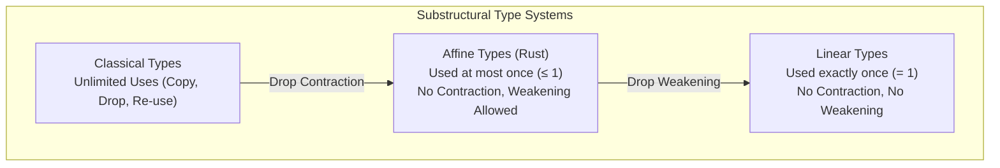
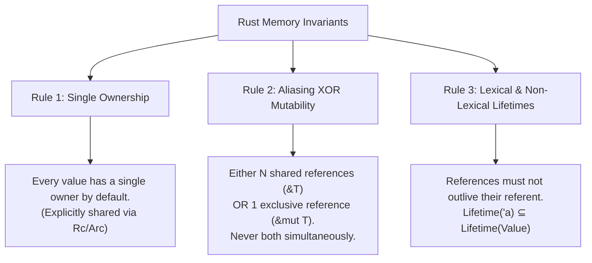
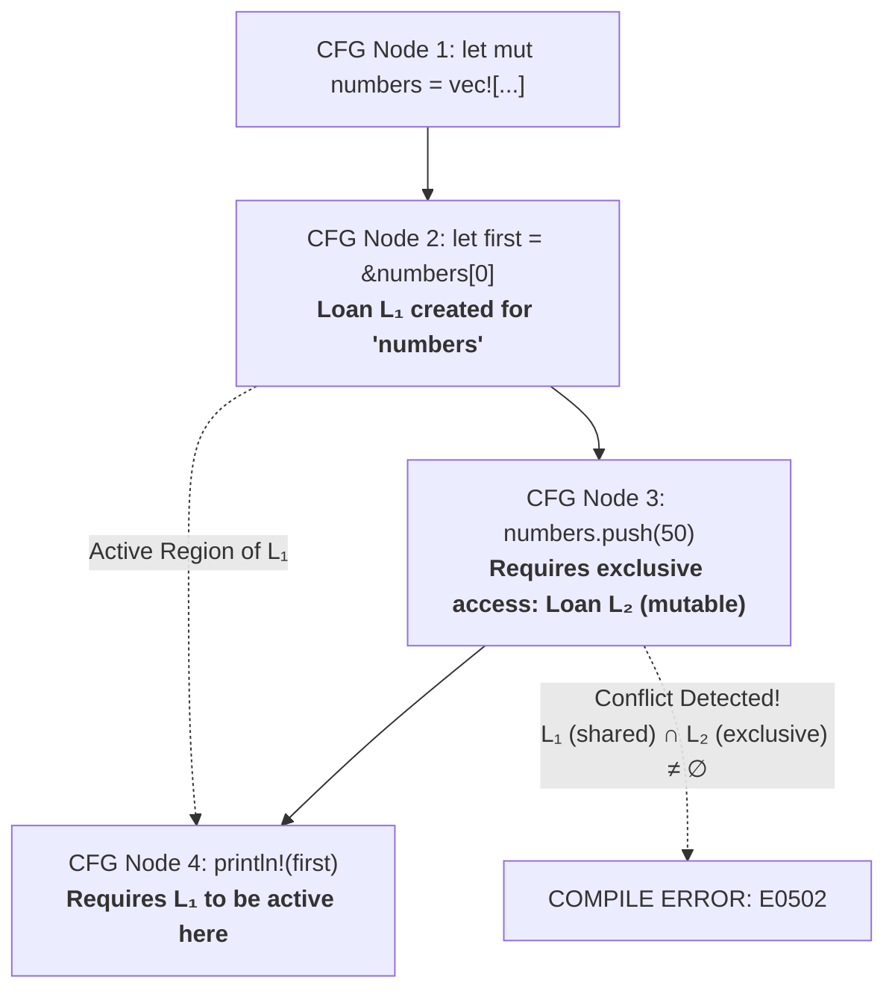
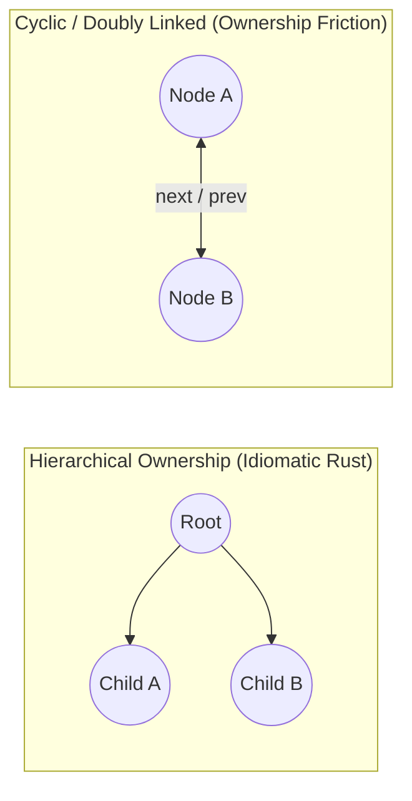
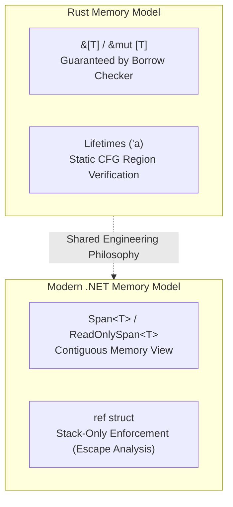

# Memory Safety Without a GC: The Mathematical Guarantees of Rust's Borrow Checker

For five decades, software engineering operated under a seemingly inescapable compromise: **you could have deterministic, low-level control over memory, or you could have memory safety—never both.**

On one side stood C and C++, offering raw pointer arithmetic, zero-cost abstractions, and predictable hardware access at the cost of catastrophic vulnerabilities: Use-After-Free (UAF), double frees, and data races. On the other side stood managed runtimes like the .NET CLR and the JVM, which solved the vulnerability crisis by introducing a Garbage Collector (GC)—purchasing safety at the expense of throughput, heap memory bloat, and non-deterministic stop-the-world pauses.

Rust changed this equation not by building a faster garbage collector or an elaborate runtime heuristic, but by grounding its compilation pipeline in formal logic: **substructural type systems**, specifically **Affine Logic**.

In this article, we dismantle the mechanics of the Rust borrow checker. We will analyze the formal foundations behind ownership and non-lexical lifetimes (NLL), trace how the compiler enforces safety invariants before emitting a single machine instruction, explore the real-world trade-offs when dealing with cyclic data structures, and examine how these same memory safety principles are mirrored in modern high-performance C# through `Span<T>` and `ref struct`.

---

## The Problem: The Memory Management Spectrum

To understand why Rust's approach was revolutionary, we must first map the engineering trade-offs that preceded it.

```mermaid
graph LR
    subgraph Manual["Manual Memory Management (C / C++)"]
        M1["Deterministic Latency"]
        M2["Zero Runtime Cost"]
        M3["Vulnerability Surface: UAF, Double-Free, Data Races"]
    end

    subgraph Managed["Tracing GC (.NET / JVM / Go)"]
        G1["Guaranteed Spatial Safety"]
        G2["High Developer Velocity"]
        G3["Latency Spikes, Cache Misses, Memory Bloat"]
    end

    subgraph Affine["Static Verification (Rust)"]
        R1["Deterministic Deallocation (RAII)"]
        R2["Zero-Cost Verification"]
        R3["No Runtime GC Pause"]
    end

    Manual -.->|"Safety Deficit"| Managed
    Managed -.->|"Performance Deficit"| Affine
```



### 1. The Manual Pole: High Throughput, Severe Fragility

In unmanaged languages, memory lifecycle is entirely manual:

```c
// Classic C dangling pointer / Use-After-Free vulnerability
int* buffer = (int*)malloc(1024 * sizeof(int));
// ... populate buffer ...
free(buffer);

// Buffer is deallocated, but the pointer still holds the virtual memory address
do_something_else(); // Heap allocator reallocates this page
printf("%d\n", buffer[0]); // Undefined Behavior: Use-After-Free (UAF)
```

At machine level, virtual memory does not understand "ownership." A pointer is simply an integer denoting an address in the virtual address space. Once `free(buffer)` marks those bytes as reusable in the allocator's freelist, accessing `buffer[0]` may:
- Read corrupted memory (silent data corruption).
- Crash the process via `SIGSEGV` if the page was unmapped.
- Become an exploitable security primitive (e.g., control-flow hijacking if the freed memory is reallocated for function pointers or vtables).

This is not a theoretical edge case. In 2019, the Microsoft Security Response Center (MSRC) revealed in their [vulnerability mitigation research](https://github.com/microsoft/MSRC-Security-Research/blob/master/presentations/2019_02_BlueHatIL/2019_01%20-%20BlueHatIL%20-%20Trends%2C%20challenge%2C%20and%20shifts%20in%20software%20vulnerability%20mitigation.pdf) that **~70% of all vulnerabilities patched across Microsoft products since 2006 were memory safety issues**. The [Google Chromium project](https://www.chromium.org/Home/chromium-security/memory-safety/) published virtually identical numbers: [around 70% of their high-severity security bugs](https://security.googleblog.com/2020/05/memory-safety-in-chrome.html) were memory unsafety errors, with Use-After-Free leading the category.

### 2. The Tracing GC Pole: Safety Purchased via Latency and Bloat

Managed environments eliminate this entire class of bugs by delegating memory reclamation to a tracing garbage collector:

```csharp
// C# / CLR: Safe, but the GC must trace and reclaim
public void ProcessData()
{
    var list = new List<int>(1024);
    // ... work ...
    // Scope terminates. 'list' is unreachable from GC roots,
    // awaiting reclamation during the next Gen0/Gen1 collection pass.
}
```

The CLR guarantees that no pointer will ever dangle: memory is only collected when the tracing engine determines unreachability from the set of active execution roots (stack frames, CPU registers, static references) through graph traversal.

However, this guarantee carries substantial structural overhead:
1. **Latency Jitter**: Even modern generational, concurrent, and compacting collectors (such as the .NET Server GC or Java's ZGC) must synchronize thread execution, scan heaps, and promote surviving objects between generations (Gen0 $\to$ Gen1 $\to$ Gen2).
2. **Memory Overhead**: Tracing garbage collectors generally require additional memory headroom above the active working set to maintain high application throughput and prevent excessive collection frequency, the exact multiplier varying significantly across collector architectures and workload patterns.
3. **Cache Invalidation and Header Penalty**: On current 64-bit .NET runtimes, each heap object typically incurs a **16-byte object header** (an 8-byte `SyncBlock` index plus an 8-byte `MethodTable` pointer, subject to alignment and runtime-specific details). Thousands of small, fine-grained heap objects degrade CPU L1/L2 cache line utilization ($64$ bytes per cache line).

The industry spent decades searching for a third option: **deterministic, compile-time memory safety without a runtime collector.**

---

## Linear & Affine Types: The Math Behind Ownership

Rust did not invent ownership out of thin air; it is an applied implementation of **substructural type systems**, rooted in Jean-Yves Girard's **Linear Logic (1987)**.

### Substructural Logic: Dropping Classical Assumptions

In classical formal logic (Gentzen's sequent calculus), hypotheses or assumptions can be used arbitrarily. If you know that proposition $A$ is true, you can ignore $A$ (use it zero times), duplicate $A$, or use it ten times without violating logical consistency.

These behaviors are governed by three classical **structural rules** on sequents $\Gamma \vdash C$ (where $\Gamma$ represents the context of available assumptions and $C$ is the conclusion):

- **Exchange (Order Invariance)**: The order in which assumptions are introduced does not affect provability:
  $$\Gamma, A, B, \Delta \vdash C \implies \Gamma, B, A, \Delta \vdash C$$

- **Weakening (Discarding Assumptions)**: Unused assumptions can be freely introduced or discarded:
  $$\Gamma \vdash C \implies \Gamma, A \vdash C$$

- **Contraction (Duplicating Assumptions)**: An assumption can be duplicated and consumed multiple times:
  $$\Gamma, A, A \vdash C \implies \Gamma, A \vdash C$$

Substructural logic asks: *What happens if we systematically discard these structural rules?*

- **Linear Types** discard **both Weakening and Contraction**. Every resource must be consumed **exactly once** ($= 1$). It cannot be discarded (preventing resource leaks) and cannot be duplicated.
- **Affine Types** discard **Contraction**, but preserve **Weakening**. A resource can be used **at most once** ($\le 1$). You cannot duplicate it implicitly, but you are allowed to discard it.



### Why Rust Uses Affine Logic

Rust is fundamentally an **affine type system**, not a strictly linear one.

When you declare a variable in Rust, its type is affine:
```rust
let s = String::from("affine type");
let t = s; // Value moves from 's' to 't'. 's' is consumed!
```

Because **Contraction** is disallowed, `s` cannot be duplicated implicitly:

$$\text{Contraction rejected:} \quad s \implies (s, s) \quad \text{(invalid)}$$

Attempting to read `s` after this move is rejected by the compiler.

However, Rust preserves **Weakening**: you are allowed to allocate a resource and let it fall out of scope without manually using it. When this occurs, Rust deterministically invokes the destructor trait:

$$\text{Weakening in Rust:} \quad \text{Scope Exit} \implies \text{drop}(s)$$

Weakening is what transforms Rust's compile-time static analysis into deterministic, zero-cost memory reclamation (RAII).

---

## The Three Fundamental Rules of Rust

The affine type system is operationalized in the compiler through three interlocking invariants:



### Rule 1: Unique Ownership

Every value in memory has a single conceptual owner by default at any given instant (unless ownership is explicitly shared through reference-counting primitives such as `Rc` or `Arc`). Assignment transfers ownership (**move semantics**). When the owner's lexical block terminates, the memory is freed.

### Rule 2: Aliasing $\oplus$ Mutability (The Core Theorem)

The heart of Rust's safety model is the strict mathematical exclusivity between aliasing and mutation:

$$\mathbf{Aliasing} \oplus \mathbf{Mutability} \iff (\text{\&}T \land \neg\text{\&mut } T) \lor (\text{\&mut } T \land \neg\text{\&}T)$$

At any point in program execution:
1. You may have any number of immutable (shared) references (`&T`) to a resource.
2. **OR** you may have exactly one mutable (exclusive) reference (`&mut T`).
3. **You can never have both simultaneously.**

This rule alone eliminates two of the most insidious bugs in computer science:
- **Iterator Invalidation**: Modifying a collection while reading its elements.
- **Data Races**: Two threads accessing the same memory location simultaneously where at least one access is a write.

### Rule 3: Lifetimes as Invariant Regions

A reference cannot outlive the lifetime of the data it points to. Formally, if reference $r$ has lifetime `'a` and points to value $v$ with lifetime `'b`:

$$\text{Validity condition:} \quad \text{'a} \subseteq \text{'b} \quad (\text{'a is a sub-region of 'b})$$

If `'a` extends beyond `'b`, the compiler proves that $r$ could point to unallocated memory, rejecting the program at compile time.

---

## The Borrow Checker in Action: Compile-Time Invariant Verification

Let us inspect a classic memory corruption pattern and examine how Rust's borrow checker rejects it.

### The Classic Failure: Iterator Invalidation / Heap Reallocation

Consider the following program:

```rust
fn main() {
    let mut numbers = vec![10, 20, 30, 40];

    // Shared borrow (&numbers[0])
    let first = &numbers[0];

    // Mutation requires exclusive borrow (&mut numbers)
    numbers.push(50);

    // Attempted use of the shared reference
    println!("The first number is: {}", first);
}
```

### What Happens at the Hardware Level in C++?

In C++, the equivalent code compiles without warnings:

```cpp
#include <iostream>
#include <vector>

int main() {
    std::vector<int> numbers = {10, 20, 30, 40};
    const int& first = numbers[0]; // Raw pointer under the hood

    numbers.push_back(50); // Capacity exceeded! Reallocation triggered!

    // Undefined Behavior: 'first' points to freed heap memory
    std::cout << "The first number is: " << first << std::endl;
    return 0;
}
```

If `numbers` has reached its capacity ($4$ elements), `push_back(50)` performs three low-level actions:
1. Allocates a new, larger buffer on the heap (e.g., $8$ elements).
2. Copies/moves the old elements to the new buffer.
3. Calls `free()` on the original heap buffer.

The reference `first` continues to hold the memory address of the **deallocated buffer**. Dereferencing it is a classic **Use-After-Free**.

### The Rust Diagnostic

Rust refuses to compile this code. When passed to `rustc`, the borrow checker halts the build pipeline:

```text
error[E0502]: cannot borrow `numbers` as mutable because it is also borrowed as immutable
  --> src/main.rs:8:5
   |
5  |     let first = &numbers[0];
   |                  ------- immutable borrow occurs here
...
8  |     numbers.push(50);
   |     ^^^^^^^^^^^^^^^^ mutable borrow occurs here
9  |
10 |     println!("The first number is: {}", first);
   |                                         ----- immutable borrow later used here
```

### How the Compiler Formulates the Invariant

The stable Rust compiler verifies borrows using **Non-Lexical Lifetimes (NLL)** implemented in the MIR-based borrow checker. Rather than tying lifetimes strictly to lexical blocks (`{ ... }`), NLL models validation as a region-based **constraint satisfaction problem** over the function's Control Flow Graph (CFG). (The ongoing **Polonius** research project investigates a next-generation, Datalog-based formulation that models origins and loans as relational facts to further enhance expressiveness in future compiler releases):



1. **Loan Creation**: At statement `let first = &numbers[0]`, the compiler issues a static loan $L_1$ on `numbers`.
2. **Liveness Analysis**: The compiler determines the liveness range of the binding `first`. Because `first` is read in statement 10 (`println!`), the loan $L_1$ must remain active throughout the interval $[2, 4]$ on the CFG.
3. **Conflicting Access Verification**: At statement 8 (`numbers.push(50)`), the method signature of `Vec::push` requires an exclusive reference:
   $$\text{push}: \text{\&mut Self} \times T \to ()$$
   To satisfy this signature, the compiler must establish an exclusive loan $L_2$ on `numbers`.
4. **The Contradiction**: The loan checker evaluates the intersection of the active loans:
   $$\text{ActiveLoans}(\text{Node } 3) = \{ L_1, L_2 \}$$
   Since $L_1$ is a shared loan ($\text{\&}T$) and $L_2$ is an exclusive loan ($\text{\&mut } T$), the safety invariant is violated:
   $$\text{Shared}(\text{numbers}) \land \text{Exclusive}(\text{numbers}) \implies \bot \quad (\text{Contradiction})$$

The compiler proves that the program violates Rust's borrowing and aliasing invariants, refusing to generate binary output for code that falls outside its conservative safe subset. Note that at runtime, if `numbers` happened to have spare allocated capacity, a reallocation would not strictly occur on that specific execution; however, because the compiler enforces conservative static analysis without dynamic runtime assumptions, it halts compilation to guarantee unconditional safety.

---

## The Trade-Offs: Why Rust Isn't Always the Answer

Rust's guarantees are profound, but they do not come without significant engineering costs. The borrow checker is not omniscient; it enforces a conservative static analysis. Any program that cannot be proven safe within its axiomatic framework is rejected—even if the algorithm is logically sound at runtime.

### 1. The Friction of Cyclic Data Structures

Rust is fully capable of representing cyclic graphs and linked structures, but they cease being straightforward, hierarchical ownership trees. In an affine type system, natural ownership flows downward like a directed acyclic tree. When Node $A$ and Node $B$ mutually reference each other, the strict single-owner model encounters significant architectural friction.



If you attempt to implement a doubly-linked list naively where each node holds an `Option<Box<Node>>` to `next` and a reference `Option<&'a Node>` to `prev`:
- The lifetime of the back-reference `'a` ties up the entire structure.
- Mutating any node requires an exclusive borrow `&mut`, which conflicts with the existing shared borrows held by neighboring nodes.

To handle cyclic graphs, state machines with back-references, or complex pointer networks, developers must step outside pure hierarchical ownership and reach for specific architectural patterns:

| Solution | Mechanism | Trade-off |
| :--- | :--- | :--- |
| `Rc<RefCell<T>>` / `Arc<Mutex<T>>` | Interior mutability via runtime borrow counting | Moves borrow checks to runtime. Reintroduces cache misses, atomic instruction overhead, and risk of runtime panics (`BorrowMutError`). |
| **Arena Allocation + Indices** | Storing nodes in a flat `Vec<T>` and referencing nodes by integer index (`usize`) | Safe and cache-friendly, but reintroduces index-out-of-bounds risks and stale-index logical bugs. |
| `unsafe` Raw Pointers (`*mut T`) | Opting out of compiler verification | Reintroduces the entire C vulnerability surface (dangling pointers, UAF). |

### 2. Compilation Latency and Cognitive Overhead

Because Rust performs exhaustive monomorphization of generics, whole-program lifetime constraint resolution, and aggressive LLVM optimization passes, **build times are significantly longer** than those of C#, Go, or Java.

Furthermore, the mental model requires upfront architectural commitment: data structures cannot be improvised dynamically. You must know your ownership topology before writing code.

---

## The Bridge to C# and .NET: Convergence on Stack Safety

Understanding Rust's ownership model provides immense insight into the broader evolution of modern systems engineering—including .NET. While C# did not copy Rust directly (both ecosystems addressed memory management challenges through distinct runtime models), they arrived at surprisingly convergent conclusions regarding high-throughput data paths.

Between the late .NET Framework era and .NET 10, Microsoft engaged in an architectural overhaul of the runtime. The catalyst was a pragmatic realization: **in high-throughput network pipelines (such as ASP.NET Core Kestrel), heap allocation churn was the primary bottleneck.**

Every temporary byte array allocated to slice an incoming HTTP packet or parse a JSON payload was generating unnecessary GC pressure, polluting Gen0/Gen1, and inducing cache misses.

Rather than abandoning the tracing Garbage Collector for application logic, the .NET team introduced **affine-like, stack-bound safety invariants into C#**. Both ecosystems solve contiguous slicing and safety without GC overhead on the hot path, but within their respective architectural boundaries:



### 1. `Span<T>` and `ReadOnlySpan<T>`: The Safe View into Memory

Historically in C#, passing a sub-array required either:
- Allocating a new sub-array (`array[start..end]`), copying memory to the heap.
- Using `unsafe` raw pointers (`int*`), losing bounds checking and safety.

.NET Core 2.1 introduced [`Span<T>`](https://www.youtube.com/watch?v=5KdICNWOfEQ) (explored deeply by Stephen Toub and Scott Hanselman in [*Deep .NET: A Complete .NET Developer's Guide to Span*](https://www.youtube.com/watch?v=5KdICNWOfEQ)): a contiguous, typed view over arbitrary memory:

```csharp
// Zero-allocation slicing across stack, heap, or native memory
Span<byte> stackBuffer = stackalloc byte[256];
Span<byte> slice = stackBuffer.Slice(10, 50); // Zero heap allocations!
```

Under the hood, `Span<T>` is a **by-ref-like tuple**:
```csharp
// Conceptual representation inside the CLR
public readonly ref struct Span<T>
{
    internal readonly ref T _pointer;
    internal readonly int _length;
}
```

### 2. `ref struct`: Compiler-Enforced Stack Affine Types

How does the C# compiler ensure that a `Span<T>` pointing to stack memory allocated via `stackalloc` does not outlive its stack frame? If a method could return a `Span<T>` over its own stack frame, it would recreate C's classic dangling pointer bug.

The C# team solved this by creating **`ref struct`**:

```csharp
public ref struct CustomBuffer
{
    public Span<int> Data;
}
```

When a type is marked `ref struct`, the Roslyn compiler enforces **strict stack-escape rules**:
1. **No Boxing**: It cannot be cast to `object`, `ValueType`, or any interface (until C# 13's constrained anti-patterns).
2. **No Heap Containment**: It cannot be declared as a field inside a standard `class` or normal `struct`.
3. **No Async / Yield Captures**: It cannot be captured inside closures, lambda expressions, or across `await` boundaries in `async` state machines.
4. **Escape Analysis**: A `ref struct` cannot be returned from a method if it was derived from local stack variables.

This is the C# equivalent of Rust's lifetime constraint:

$$\text{C\# ref safety guarantee:} \quad \text{Scope}(\text{Span}\langle T \rangle) \subseteq \text{Scope}(\text{StackFrame})$$

### Rust vs. Modern .NET: Architectural Comparison

| Dimension | Rust | C# (.NET 9 / .NET 10) |
| :--- | :--- | :--- |
| **Primary Safety Paradigm** | Static Affine Type System (Compile-Time) | Tracing Generational GC + Stack-Bound Affine Types |
| **Memory Allocation Default** | Stack / Value by default; Heap explicit (`Box`, `Vec`) | Heap by default (`class`); Stack explicit (`struct`, `ref struct`) |
| **Contiguous Slices** | `&[T]` (immutable), `&mut [T]` (mutable) | `ReadOnlySpan<T>` (read-only), `Span<T>` (mutable) |
| **Lifetime Enforcement** | Formal Region Inference & Generic Lifetimes (`'a`) | Roslyn compiler `ref` safety escape rules |
| **Heap Object Header** | **0 bytes** (Raw structs without headers) | Typically **16 bytes** on current x64 (`SyncBlock` + `MethodTable`) |
| **Deallocation Predictability** | Deterministic on scope exit via `Drop` | Deterministic on stack; Non-deterministic on GC heap |
| **Concurrency Guarantees** | Compile-time thread safety (`Send` / `Sync`) | Runtime locks, memory barriers, concurrent primitives |

---

## Conclusion: The Theoretical Foundation

Memory safety is not merely an implementation detail of programming language runtimes; it is an invariant verified either:
1. **At runtime** through graph reachability traversal (Tracing Garbage Collection).
2. **At compile time** through conservative static analysis grounded in affine type logic and region subtyping (The Borrow Checker).

Rust demonstrated that systems software does not require a garbage collector to achieve provable spatial and temporal memory safety, reshaping how infrastructure software is constructed across operating systems, cloud hypervisors, and browsers.

Equally important, the industry-wide push for zero-overhead safety influenced how managed runtimes approach high-throughput design. Modern C# did not abandon its garbage collector; instead, it synthesized both paradigms. By introducing `Span<T>`, `ReadOnlySpan<T>`, and compiler-enforced `ref struct` escape rules, .NET adopted stack-bound affine guarantees for performance-critical computing, while preserving the velocity and convenience of a tracing GC for broader application domains.

In the upcoming articles of this series, we will build directly upon these theoretical pillars—exploring how the modern .NET runtime implements zero-copy network pipelines, analyzes SIMD vectorization via `TensorPrimitives`, and leverages hardware intrinsics without sacrificing memory safety.
